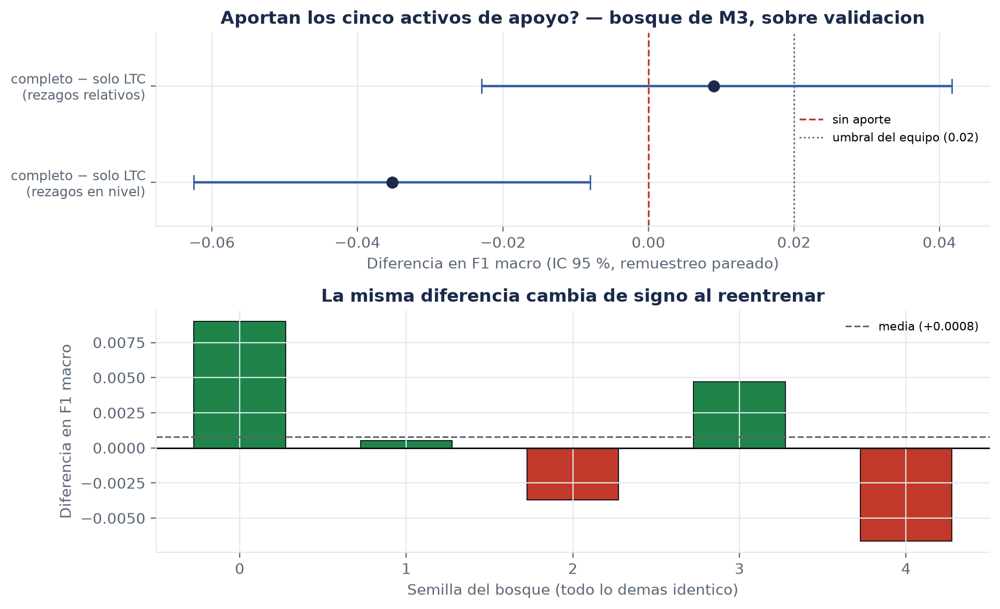

# ¿Aportan los cinco activos de apoyo información sobre LTC?

**Autor:** Alejandro Zamora (M2) · **Issue:** [S4-M2-01](https://github.com/NeoFao/caso1-ltc-inflexion/issues/29)

> **Resultado en una línea.** No se puede afirmar que aporten. La diferencia medida es de
> **+0,0090** en F1 macro, su intervalo de confianza del 95 % **incluye el cero**, está por
> debajo del umbral de decisión del equipo (0,02), y **cambia de signo** al reentrenar el
> mismo modelo con otra semilla. Es un resultado negativo, y está bien medido.

---

## 1. Por qué la pregunta importa

Todo el planteamiento del caso descansa en un supuesto: que BTC, ETH, SOL, XRP y ADA dicen
algo sobre los puntos de inflexión de LTC. Si el supuesto es falso, el proyecto sigue siendo
válido —lo que cambia es la conclusión, no el método— pero seguir afirmándolo sin medirlo sí
sería un problema.

El enunciado del issue lo dice mejor de lo que podría decirlo yo: *"un resultado negativo bien
medido vale más que uno positivo mal medido"*.

## 2. Por qué no alcanzaba con la ablación que ya existía

`src/features/ablacion.py` ya compara el conjunto completo contra `solo_LTC`. Sus cifras están
en `docs/evidencias/m2-ablacion.json`. No sirven para responder esto, por dos razones distintas.

**La primera: el modelo lineal de contraste no le gana al azar.** La ablación usa una regresión
logística fija, elegida a propósito para que las familias se comparen entre sí en igualdad de
condiciones. Con características estacionarias ese modelo obtiene F1 macro **0,2550**, contra
**0,3161** del baseline trivial y **0,3368** del aleatorio. Una diferencia medida sobre un
modelo que no supera al azar no dice si la información está en los datos; dice que ese modelo
no la usa.

**La segunda, y más incómoda: la ablación lineal y el bosque discrepan en el signo.**

| | conjunto completo | `solo_LTC` | diferencia |
|---|---|---|---|
| Regresión logística (rezagos en nivel) | 0,3485 | 0,2478 | **+0,1008** |
| Bosque de M3 (rezagos en nivel) | 0,3443 | 0,3795 | **−0,0352** |

Con el mismo panel y las mismas columnas, un modelo dice que quitar los activos de apoyo
*empeora* mucho y el otro dice que *mejora*. No es un matiz: es evidencia de que la cifra de
+0,1008 nunca fue una medición del aporte multivariante.

## 3. Cómo se midió esta vez

- **Modelo:** el bosque de M3, importado tal cual (`src.modelos.clasico.BosqueAleatorio`), no
  una reimplementación equivalente. Mismos hiperparámetros, misma imputación dentro del
  pipeline, mismo filtrado de filas que el arnés de M0.
- **Conjunto:** validación. Esta es una decisión de representación, y decidirla mirando el
  bloque de prueba lo gastaría.
- **Contraste:** conjunto completo (63 columnas) contra `solo_LTC` (28 columnas), quitando las
  de los cinco activos de apoyo y las de correlación cruzada.
- **Incertidumbre:** bootstrap estratificado **pareado**, 1000 remuestras, semilla 0. Pareado
  porque los dos modelos aciertan y fallan sobre las mismas velas: comparar dos intervalos por
  separado sobreestimaría la incertidumbre de su diferencia.
- **Las dos representaciones:** con rezagos en nivel de precio y con rezagos relativos.

**Control previo (regla 2 del proyecto).** Antes de publicar nada, el bosque completo con
rezagos en nivel tiene que reproducir el F1 macro que M3 publicó para
`bosque_aleatorio_rezagos_en_nivel` sobre
validación. Da **0,3443065490**, idéntico hasta el último dígito a
`docs/evidencias/modelo-clasico-4h-w7-h1-rezagos-en-nivel.json`. Si no coincidiera, el script se detiene sin
escribir.

## 4. Los resultados

**Tabla 1.** Aporte de los activos de apoyo, bosque de M3, sobre validación (n = 1959).

| Representación | completo | `solo_LTC` | diferencia | IC 95 % | ¿excluye el 0? |
|---|---|---|---|---|---|
| Rezagos relativos | 0,3905 | 0,3815 | **+0,0090** | [−0,0229, +0,0417] | **no** |
| Rezagos en nivel | 0,3443 | 0,3795 | −0,0352 | [−0,0625, −0,0080] | sí, por el lado negativo |

Fuente: `docs/evidencias/m2-multivariante-4h-w7-h1.json`.

La fila que vale es la primera. La segunda se publica al lado para mostrar el tamaño del
artefacto que producen los precios no estacionarios, no como resultado alternativo: **con
rezagos en nivel, agregar los cinco activos de apoyo empeora el modelo de forma
estadísticamente distinguible**, porque son 35 columnas más de proxy de posición temporal
sobre las que sobreajustar.

## 5. La comprobación que decide

Un intervalo de confianza por bootstrap acota una sola fuente de ruido: la del **conjunto de
evaluación**. Responde "si me hubieran tocado otras velas, ¿cuánto cambiaría?". No dice nada
sobre la otra fuente, que es el **ajuste del propio bosque**: 300 árboles con otra semilla dan
otro modelo.

**Tabla 2.** La misma diferencia, cambiando únicamente la semilla.

| Semilla | completo | `solo_LTC` | diferencia |
|---|---|---|---|
| 0 | 0,3905 | 0,3815 | +0,0090 |
| 1 | 0,3739 | 0,3733 | +0,0005 |
| 2 | 0,3814 | 0,3851 | −0,0037 |
| 3 | 0,3854 | 0,3807 | +0,0047 |
| 4 | 0,3737 | 0,3803 | −0,0066 |
| | | **media** | **+0,0008** |

**La diferencia cambia de signo.** El +0,0090 de la semilla 0 es el extremo superior del ruido
de reentrenamiento, no un efecto. La media sobre cinco semillas es +0,0008: dos órdenes de
magnitud por debajo del umbral de decisión del equipo.

Esto es lo que convierte el resultado en concluyente. Sin esta tabla, el intervalo
[−0,0229, +0,0417] admitía la lectura optimista de "el punto estimado es positivo". Con ella,
no.

**Figura 1.** Diferencia con su intervalo (arriba) y la misma diferencia por semilla (abajo).

## 6. Qué se puede afirmar y qué no

**Se puede afirmar:**

1. Con la representación estacionaria, el aporte de los cinco activos de apoyo es
   **indistinguible de cero** sobre este modelo, este conjunto y este horizonte.
2. Con la representación en nivel de precio, agregarlos **empeora** el modelo.
3. El modelo completo con rezagos relativos **sí supera al baseline aleatorio** —diferencia
   +0,0537, IC [+0,0137, +0,0929], que excluye el cero—. El proyecto detecta algo; lo que no se
   sostiene es que lo detecte *gracias a los otros activos*.

**No se puede afirmar** que los activos de apoyo no aporten nada. El intervalo es ancho y
admite un efecto de hasta +0,04. Lo que se agotó no es la hipótesis, es la resolución de esta
medición: con 420 ejemplos de la clase minoritaria en entrenamiento y 1959 velas de validación
no hay potencia para distinguir un efecto de ese tamaño.

La diferencia entre las dos frases es exactamente la que separa un resultado honesto de uno
sobrevendido en cualquiera de las dos direcciones.

## 7. Decisión propuesta

**Conservar las columnas de los activos de apoyo, y reportar que no se demostró su aporte.**

Conservarlas porque no perjudican en la representación estacionaria y porque el enunciado pide
un tratamiento multivariante; reportarlo porque es lo que dicen los números.

Esto **no cierra** la pregunta del proyecto. La abre en un sitio más útil: si los otros activos
informan sobre LTC, no lo hacen a través de rezagos y correlaciones móviles con un bosque a
horizonte de 4 horas. Dónde sí, es material para el trabajo futuro.

---

> **Nota sobre reproducibilidad.** Todos los números salen de
> `uv run python -m src.features.multivariante`, que deja
> `docs/evidencias/m2-multivariante-4h-w7-h1.json` y la Figura 1. El script no escribe nada si
> el control contra la cifra de M3 no reproduce.
