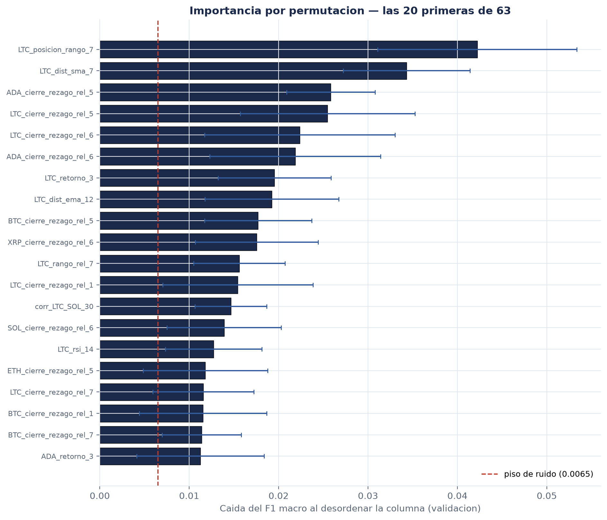

# ¿Cuáles características aportan? Medición por permutación

**Autor:** Alejandro Zamora (M2) · **Issue:** [S3-M2-01](https://github.com/NeoFao/caso1-ltc-inflexion/issues/25)

> **Resultado en una línea.** De las 63 columnas, **17 son indistinguibles de columnas de ruido
> inventadas**. Quitarlas mejora el modelo en las cinco semillas probadas (media **+0,0051** de
> F1 macro, nunca negativo). Es RF-F4 medido en vez de supuesto.

---

## 1. Por qué no sirve la importancia que trae el bosque

`BosqueAleatorio.importancias()` devuelve la importancia por impureza, la de fábrica de
scikit-learn. Tiene dos sesgos y los dos pegan justo en este problema:

- **Favorece a las variables de alta cardinalidad.** Una columna continua ofrece más puntos de
  corte que una casi discreta, así que acumula reducción de impureza aunque no informe más.
- **Se calcula sobre entrenamiento.** Mide de qué se colgó el modelo para ajustar lo que ya vio,
  no qué le sirve para predecir lo que no vio.

La **importancia por permutación** mide otra cosa: cuánto cae el F1 macro **sobre validación** al
desordenar una columna, dejando todo lo demás igual. Si una columna se puede barajar sin que el
resultado se mueva, el modelo no la estaba usando para nada útil.

Se usa F1 macro y no exactitud porque es la métrica de decisión del proyecto (D5). Con 90 % de
Continuidad, ordenar por exactitud daría un orden sin sentido.

## 2. El control que hace que la tabla signifique algo

Una tabla ordenada por importancia **siempre** se puede leer. Aunque las 63 columnas fueran ruido
puro, alguna quedaría primera. Sin un punto de comparación, "el rezago 5 es la tercera más
importante" no dice si es importante o si simplemente hay que ordenar de alguna manera.

Así que se entrena un segundo modelo con las mismas columnas **más cinco centinelas**: columnas
de ruido puro, con semilla fija, que por construcción no pueden informar nada. La importancia más
alta que alcanza una centinela es el **piso de ruido**.

**Piso medido: 0,0065.** Toda característica real por debajo de ese valor es indistinguible de
una columna inventada.

Dos comprobaciones sobre el piso mismo:

- **Añadir las centinelas casi no mueve el modelo** (F1 0,3896 contra 0,3905 del real), así que
  el piso se mide sobre algo comparable.
- **Con 15 centinelas en vez de 5**, el modelo auxiliar sí se degrada (F1 0,3664) y el piso baja
  a 0,0039, dejando pasar 50 columnas en vez de 46. Se usa el de 5 por dos razones: es el más
  exigente, y un piso medido sobre un modelo peor no es el piso de este modelo.

De paso, ese segundo resultado es **RF-F4 en estado puro**: 15 columnas de ruido le cuestan al
bosque 0,024 de F1 macro, más que todo el aporte multivariante medido en S4-M2-01.

## 3. La tabla

**Tabla 1.** Las 15 características más importantes por permutación (validación, n = 1959,
10 permutaciones por columna).

| # | Columna | Familia | Caída media | Desviación |
|---|---|---|---|---|
| 1 | `LTC_posicion_rango_7` | ventana deslizante | **0,0422** | 0,0111 |
| 2 | `LTC_dist_sma_7` | indicadores técnicos | **0,0343** | 0,0071 |
| 3 | `ADA_cierre_rezago_rel_5` | rezagos | 0,0258 | 0,0050 |
| 4 | `LTC_cierre_rezago_rel_5` | rezagos | 0,0255 | 0,0098 |
| 5 | `LTC_cierre_rezago_rel_6` | rezagos | 0,0224 | 0,0107 |
| 6 | `ADA_cierre_rezago_rel_6` | rezagos | 0,0219 | 0,0096 |
| 7 | `LTC_retorno_3` | retornos | 0,0195 | 0,0063 |
| 8 | `LTC_dist_ema_12` | indicadores técnicos | 0,0192 | 0,0075 |
| 9 | `BTC_cierre_rezago_rel_5` | rezagos | 0,0177 | 0,0060 |
| 10 | `XRP_cierre_rezago_rel_6` | rezagos | 0,0176 | 0,0069 |
| 11 | `LTC_rango_rel_7` | ventana deslizante | 0,0156 | 0,0051 |
| 12 | `LTC_cierre_rezago_rel_1` | rezagos | 0,0154 | 0,0084 |
| 13 | `corr_LTC_SOL_30` | correlación cruzada | 0,0147 | 0,0040 |
| 14 | `SOL_cierre_rezago_rel_6` | rezagos | 0,0139 | 0,0064 |
| 15 | `LTC_rsi_14` | indicadores técnicos | 0,0127 | 0,0054 |

Fuente: `docs/evidencias/m2-importancia-4h-w7-h1.json`. Tabla completa en el `.csv` del mismo
nombre.

**Figura 1.** Las 20 primeras con su dispersión, y el piso de ruido marcado.

**La primera confirma la hipótesis de la guía.** `posicion_rango_7` encabeza por margen amplio, y
tiene la lectura que ya está declarada en S1-M2-03: contiene la mitad computable hacia atrás de
la definición de la etiqueta. No es fuga —usa solo información hasta *t*— pero tampoco es un
descubrimiento sobre el mercado.

## 4. Dónde discrepa con la importancia del bosque

**Correlación de rangos (Spearman): 0,61.** Coinciden en lo grueso y se separan en el detalle,
que es exactamente lo esperable si los sesgos de la impureza son reales.

Cuatro columnas están en el top 10 por impureza y no por permutación:

`LTC_bollinger_pctb_20` · `LTC_cierre_rezago_rel_7` · `LTC_retorno_1` · `LTC_retorno_7`

Son continuas y de alta cardinalidad, que es justo lo que la impureza premia. El bosque las usó
mucho para partir el entrenamiento; barajarlas en validación casi no lo despeina.

**Consecuencia práctica:** el bloque `importancias_top10` de
`modelo-clasico-4h-w7-h1-rezagos-relativos.json` no debe citarse como "las características que
aportan". Describe de qué se colgó el modelo al entrenar, que es otra pregunta.

## 5. Una tensión con S4-M2-01, y cómo se resuelve

`ADA_cierre_rezago_rel_5` aparece **tercera**. Otros cuatro activos de apoyo están en el top 15.
Y sin embargo S4-M2-01 concluyó que quitar *todos* los activos de apoyo no cambia el resultado de
forma distinguible.

**Las dos cosas son ciertas y no se contradicen.** Miden preguntas distintas:

- La permutación pregunta *"¿de qué depende este modelo ya ajustado?"*. Responde: entre otras
  cosas, del rezago 5 de ADA.
- La ablación pregunta *"¿qué pasa si entreno sin esa familia?"*. Responde: nada apreciable.

La explicación es la redundancia. Las seis series correlacionan a 0,62 en retornos, así que el
rezago de ADA es en buena medida un sustituto del de LTC. Si está, el modelo lo usa; si no está,
usa el de LTC y llega parecido. **Permutar mide dependencia; ablacionar mide información única.**

Es la razón por la que la advertencia del JSON dice que no superar el piso **no prueba que una
columna sea inútil**: con columnas correlacionadas, la permutación reparte el crédito entre ellas
y subestima a las dos.

## 6. Por familia

**Tabla 2.** Importancia agregada por familia (suma de caídas medias).

| Familia | Columnas | Caída total | Máxima | Mediana |
|---|---|---|---|---|
| Rezagos | 24 | 0,2773 | 0,0258 | 0,0105 |
| Retornos | 17 | 0,1287 | 0,0195 | 0,0083 |
| Indicadores técnicos | 10 | 0,1218 | 0,0343 | 0,0098 |
| Ventana deslizante | 4 | 0,0700 | **0,0422** | 0,0109 |
| Correlación cruzada | 5 | 0,0386 | 0,0147 | 0,0077 |
| Volatilidad | 3 | 0,0242 | 0,0103 | 0,0081 |

**Ventana deslizante es la familia más eficiente por columna**: cuatro columnas y la más
importante de todas. Retornos es la más difusa: 17 columnas para la mitad de la caída total de
rezagos.

## 7. La decisión, medida y no opinada

La tabla dice de qué se apoya el modelo. **No dice qué pasa si se le quitan las que no usa** —
eso hay que entrenarlo. Así que se entrenó, con y sin las 17 que no superan el piso, con cinco
semillas:

**Tabla 3.** Efecto de quitar las 17 columnas que no superan el piso de ruido.

| Semilla | Completo (63) | Recortado (46) | Diferencia |
|---|---|---|---|
| 0 | 0,3905 | 0,3936 | +0,0031 |
| 1 | 0,3739 | 0,3751 | +0,0012 |
| 2 | 0,3814 | 0,3852 | +0,0038 |
| 3 | 0,3854 | 0,3898 | +0,0044 |
| 4 | 0,3737 | 0,3865 | +0,0128 |
| | | **media** | **+0,0051** |

**Mejora en las cinco.** Nunca cambia de signo — que es la comprobación que en S4-M2-01 hundió al
aporte multivariante y que acá aguanta.

### Lo que se propone

**Conservar 46 columnas y descartar 17.** Con dos precisiones que importan:

1. **+0,0051 está por debajo del umbral de decisión del equipo (0,02).** Por D5, esto **no**
   autoriza a decir "el modelo recortado es mejor". Lo que autoriza a decir es que quitarlas no
   cuesta nada y que el signo es consistente.

2. **El argumento principal no es el +0,0051, es RF-F4.** Con 420 ejemplos de la clase
   minoritaria, cada columna que no informa es superficie de sobreajuste. El experimento de las
   centinelas lo cuantifica: 15 columnas de ruido cuestan 0,024 de F1 macro.

**Esto lo aplica M3, no M2.** El recorte cambia la matriz que consume el modelo, así que no toco
`construir()` por mi cuenta: la lista de las 46 está en el JSON, bajo
`decision.columnas_que_superan_el_piso`, lista para consumirse.

## 8. Qué no se puede afirmar

- Que las 17 descartadas sean inútiles. Lo medido es que **esta medición no las distingue del
  ruido**, sobre este modelo y con 1959 velas de validación.
- Que las 46 sean las mejores 46 posibles. No se probó ningún otro corte; el piso de ruido es un
  criterio defendible, no un óptimo.
- Que el orden sea estable columna por columna. Varias caídas medias están dentro de una
  desviación de sus vecinas: lo estable es la separación entre bloques, no el puesto exacto.

---

> **Nota sobre reproducibilidad.** Todo sale de `uv run python -m src.features.importancia`, que
> deja el JSON, el CSV y la Figura 1. El script no escribe nada si el bosque no reproduce antes
> el F1 macro `0.390497720487045` que M3 y M2 midieron por separado.
