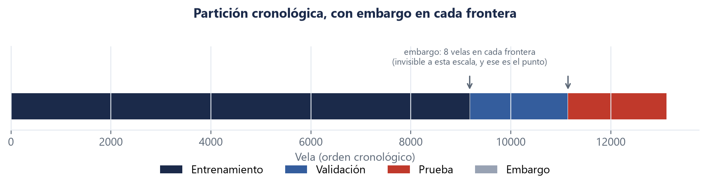

# 1. Diseño

**Autor:** Fabrizio Espinoza (M0) · **Fuente del material:** `docs/00-definicion-punto-inflexion.md`,
`docs/04-decision-w-h-granularidad.md`, D1–D4, D18 · **Todas las cifras salen de
`docs/evidencias/`.**

Esta sección responde tres preguntas de las que depende todo lo demás: **qué se predice**, **sobre
qué datos**, y **cómo se separan** los datos para que las cifras signifiquen algo.

---

## 1.1 Qué es un punto de inflexión, exactamente

«Punto de inflexión» no es una idea suelta: es una definición operativa, porque de ella salen las
etiquetas que el modelo aprende.

Una vela en el instante `t` es **máximo local** si su cierre es estrictamente mayor que el de las
`w` velas anteriores **y** que el de las `w` posteriores. **Mínimo local**, al revés. Todo lo demás
es **continuidad**.

Tres consecuencias que conviene tener presentes desde ya:

- **La etiqueta mira al futuro.** Para saber si `t` fue un máximo hay que esperar `w` velas más. Eso
  no es fuga —el modelo nunca ve esas velas— pero sí impone una latencia real, y la sección 4 la
  mide.
- **La comparación es estricta.** Se exigen `2w` desigualdades estrictas encadenadas: con `w = 7`,
  **catorce**. Esto tiene un costo que aparece en la sección 6.
- **Las clases están muy desbalanceadas**, por construcción. Un extremo local es raro.

**Tabla 1.1.** Distribución de clases en el bloque de entrenamiento.

| Clase | Código | Casos | Porcentaje |
|---|---|---|---|
| Máximo | 1 | 420 | 4,583 % |
| Mínimo | 2 | 431 | 4,703 % |
| Continuidad | 3 | 8 314 | 90,715 % |

Con esa distribución, un modelo que responda siempre «continuidad» acierta el **90,7 %** de las
veces y no detecta un solo punto de inflexión. Por eso la métrica que decide es el **F1 macro**, que
promedia las tres clases por igual, y no la exactitud.

---

## 1.2 Los tres parámetros, y por qué esos

El sistema tiene tres parámetros de los que depende todo: la **granularidad** de las velas, la
**ventana** `w` del etiquetado y el **horizonte** `h` del pronóstico. Los tres se fijaron **midiendo**,
antes de entrenar nada, y se congelaron.

El criterio se acordó **antes** de ver los resultados: hace falta un piso de **300 ejemplos de la
clase minoritaria** en entrenamiento (D4), porque debajo de eso la métrica de una clase rara se
vuelve ruido. No sale de la literatura; es una convención del equipo, y se declara como tal.

**Tabla 1.2.** Los tres parámetros y la medición que los fijó.

| Parámetro | Valor | Qué lo decidió | Decisión |
|---|---|---|---|
| Granularidad | **4 horas** | Con velas diarias **ninguna** ventana llega al piso de 300; la mejor deja 149. Con 4 horas, `w = 7` deja 420 | D1 |
| Ventana `w` | **7** | El `w` más grande que cumple el piso. `w = 10` quedó en **299**, uno por debajo | D2 |
| Horizonte `h` | **1** | La información mutua entre lo observable en `t` y la etiqueta en `t+h` cae **4,2 veces** de `h = 1` a `h = 3`, y después se aplana | D3 |

Tres cosas que vale la pena señalar de esa tabla:

**Bajar la granularidad no añade historia, la subdivide.** El período común lo acota Solana, el
activo con menos historia. Pasar de velas diarias a velas de 4 horas lleva el panel de 2 185
observaciones a **13 114** sin cubrir un día más. Lo que se compra es resolución; lo que se paga es
más ruido de microestructura y figuras menos legibles. El costo está aceptado por escrito en la D1.

**Que `w = 10` quedara en 299 es la mejor señal de que el criterio sirvió.** Un piso que aprueba
cualquier valor no es un criterio. Este descartó una opción por un ejemplo.

**El horizonte corrige un error de método, y queda escrito.** Se había propuesto `h = 5` **por
juicio**, porque predecir más lejos parecía más útil. La medición dijo `h = 1`. La D3 deja constancia
de la corrección porque el error de método importa más que el valor: se había elegido por parecer
mejor, no por evidencia.

> **Advertencia que acompaña a la D3 y que el informe repite:** el nivel absoluto de información
> mutua es **bajo para todo horizonte**, incluido `h = 1`. Lo que se interpreta es la **forma** de la
> curva —dónde cae—, no su magnitud. Esta es la primera señal, ya en el diseño, de que el problema es
> difícil.

---

## 1.3 Los datos

**Tabla 1.3.** El panel.

| | |
|---|---|
| Activos | 6 — LTC (objetivo) más BTC, ETH, SOL, XRP, ADA |
| Filas | **13 114** velas de 4 horas |
| Columnas del panel | **30** |
| Período | **11/08/2020** a **05/08/2026** |
| Características construidas | **63** (sección 2) |

El activo objetivo es **LTC**; los otros cinco son **activos de apoyo**, y si aportan o no es una de
las preguntas que el informe responde midiendo (secciones 2 y 6).

---

## 1.4 La partición, y el embargo

Los datos se parten en tres bloques **cronológicos** —nunca al azar—, porque en una serie temporal
mezclar el orden permitiría entrenar con el futuro y evaluar con el pasado.

Pero partir en orden no alcanza. **Entre bloques hay que descartar velas**, y esa es la parte que se
olvida.

**Por qué.** La etiqueta de una vela se calcula mirando `w` velas hacia adelante. Las últimas velas
del bloque de entrenamiento tienen su etiqueta calculada con velas que ya pertenecen a validación.
Sin descartarlas, el modelo vería indirectamente datos de evaluación. La documentación del código lo
dice sin rodeos:

> Es el error más caro de este tipo de proyecto porque produce resultados **excelentes y falsos**, y
> no se nota mirando las métricas.

Por eso se descartan `w + h` velas en cada frontera: el **embargo**.

La **Figura 1.1** muestra la partición completa. El embargo no se ve, y **que no se vea es el
punto**: son 16 velas de 13 114, poco más de una décima de por ciento, y evitan el error más caro de
este tipo de proyecto.

**Figura 1.1.** Partición cronológica del panel, con embargo en cada frontera.
Fuente: `docs/evidencias/informe-f2-particion.png`.

**Tabla 1.4.** La partición del panel de 13 114 velas.

| Bloque | Velas | Para qué |
|---|---|---|
| Entrenamiento | **9 171** (9 165 con etiqueta) | Ajustar los modelos |
| Validación | **1 959** | Comparar y elegir |
| Prueba | **1 968** | **Medir una sola vez, al final** (D18) |
| Embargo (descartado) | **16** | No se usa para nada |

El costo del embargo son 16 velas de 13 114 — **poco más de una décima de por ciento**. Es barato
comparado con lo que evita.

---

## 1.5 El bloque de prueba se toca una vez, y eso es comprobable

El bloque de prueba no se mira mientras se toman decisiones. Es la regla más fácil de romper sin
querer: basta correr el experimento «para ver cómo va» y ya está gastado, porque todo criterio que se
elija después está contaminado por haber visto el número.

La D18 lo prohíbe. Pero una prohibición escrita solo se puede verificar leyendo el historial y
confiando en que nadie corrió nada por fuera — o sea, no se verifica nunca.

Por eso existe un **pestillo**: la primera evaluación sobre `prueba` deja constancia en
`docs/evidencias/prueba-consumida.json` con el commit, si el árbol estaba limpio y qué modelos se
midieron. Las siguientes **fallan**, salvo que se declare un motivo por escrito, que queda registrado
junto al anterior.

No impide gastar la reserva: quien quiera puede borrar el archivo. Lo que hace es que gastarla dos
veces **deje rastro** en vez de pasar inadvertido. El objetivo no es la seguridad, es la
trazabilidad — contra el descuido, no contra la mala fe.

> **Y hubo que arreglarlo dos veces antes de usarlo.** La primera versión contaba **modelos** en vez
> de **sesiones de medición**, así que una corrida sobre seis modelos se registraba como seis
> mediciones y moría en el segundo (#100). Y dos pruebas que verificaban las guardas del protocolo
> llamaban al experimento **de verdad** sobre el bloque de prueba, frenadas únicamente por la guarda
> que estaban probando: al romper esa guarda a propósito para comprobar que fallaba, la suite gastó
> la reserva en una copia local (#109). Las dos veces el defecto se encontró **ensayando**, no
> corriendo — que es la razón por la que se ensaya.
