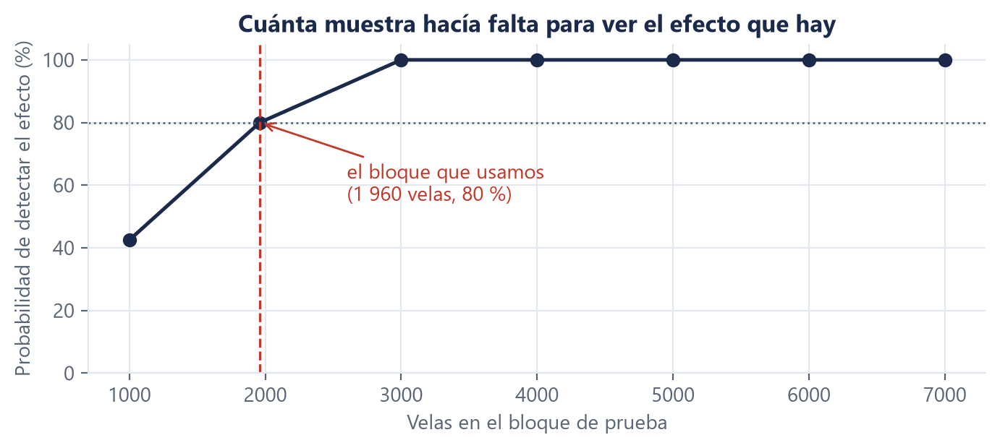

# Conclusiones

**Autor:** Fabrizio Espinoza (M0) · **Revisa:** el equipo · **Todas las cifras salen de
`docs/evidencias/`.**

---

## Lo que se sostiene

**1. El circuito es correcto y no tiene fuga.** Es la conclusión mejor respaldada del informe. El
etiquetador recupera 187 de 187 vértices plantados; el sistema alimentado vela a vela produce
predicciones **idénticas** a las del bloque completo sobre 500 velas, con **cero discrepancias**. Esa
última prueba es la única que podía detectar que algo mirara filas posteriores, y no lo detectó.

**2. El bosque clásico detecta las dos clases extremas mejor que el azar sobre validación**, con el
criterio fijado antes de medir: F1 máximo 0,108108 contra 0,051813, F1 mínimo 0,140351 contra
0,053763. Es el único modelo del que se puede afirmar eso.

**3. Ningún modelo profundo mejora al bosque.** El fundacional no se distingue de él; el avanzado
queda por debajo en las cinco semillas. Y **ninguno de los dos supera al `baseline_aleatorio` de
forma distinguible**.

**4. Los cinco activos de apoyo no aportan de forma que se pueda afirmar**, y se sabe por qué: los
seis se mueven juntos —de +0,5175 a +0,8300— y **no hay ninguna relación inversa**. Son redundantes
con LTC, y la redundancia no informa.

---

## Lo que no se sostiene

**Que el sistema sirva para operar.** La precisión direccional del mejor modelo sobre validación es
**0,103627**. Es mejor que el azar y sigue siendo baja. El informe no afirma utilidad práctica y no
hay medición que la respalde.

**Que el modelo avanzado sea distinguiblemente peor que el bosque.** Lo decía un intervalo que **no
se reproduce**. Lo que sostiene esa afirmación es el signo estable en cinco semillas, que es una
evidencia más débil y se reporta como tal.

**Que estos resultados se mantengan fuera de este período.** Con un panel estático no hay forma de
separar «el modelo detecta puntos de inflexión» de «los detecta en esta ventana temporal».

---

## Lo que el proyecto aprendió sobre cómo trabajar, que es lo que se lleva

Estas conclusiones importan más que las cifras, porque las cifras valen para un activo y un período,
y esto vale para el próximo trabajo.

**1. Un control que nunca se vio fallar no es un control.** Se adoptó como regla: cada prueba nueva
se rompe a propósito para comprobar que falla. Encontró defectos reales —incluida una prueba que,
al romperle la guarda que protegía, **gastó el bloque de prueba** en una copia local.

**2. El camino que se recorre una sola vez se ensaya entero antes.** La corrida final se ensayó dos
veces sobre validación, en una copia del repositorio. El ensayo encontró tres defectos, uno de los
cuales —un fallo de entorno por el límite de longitud de rutas— **habría reventado la corrida real a
mitad de camino, con la reserva ya gastada y sin poder repetirla**.

**3. Aplicar la regla correcta importa tanto como medir bien.** Una decisión del proyecto concluyó
que un aporte no era distinguible aplicando un umbral que se había fijado para **elegir** entre
modelos, no para responder si algo se distingue del azar. Los números estaban bien; la regla no era
la que correspondía.

**4. Un criterio se decide antes de ver el número, incluso cuando decidirlo tarde sería más cómodo.**
El día antes de la entrega se descubrió que una de las tres condiciones del proyecto no se reproducía
para uno de los modelos. Se decidió qué hacer **antes** de tocar el bloque de prueba. Después de ver
el resultado, cualquier decisión sobre el criterio habría estado contaminada.

**5. Los errores propios se corrigen por escrito y sin reescribir el pasado.** Las decisiones que
resultaron mal leídas siguen en el documento, marcadas como corregidas, con la corrección al lado. Un
documento que se reescribe para parecer que siempre tuvo razón no sirve para aprender de él.

---

## Lo que hicimos después de medir, y qué salió

La corrida sobre el bloque de prueba dejó una pregunta abierta: la ventaja sobre el azar era
positiva y estable en signo, pero su intervalo incluía el cero. **Investigamos por qué**, sin tocar
la reserva —ya gastada— y midiendo todo sobre validación.

### El diagnóstico

Medimos **por cuánto le gana cada extremo a su vecino más cercano**, que es qué tan pronunciado es:

**Tabla 1.** Margen del extremo sobre su vecino más cercano.

| Bloque | Máximos | Mínimos |
|---|---|---|
| Entrenamiento | 0,6372 % | **0,7498 %** |
| Validación | 0,6129 % | **0,8334 %** |
| Prueba | **0,4500 %** | **0,4822 %** |

**Los mínimos ganan por más margen que los máximos en los tres bloques.** Los suelos de este activo
son más pronunciados que los techos, y esa diferencia es consistente.

**Y en prueba los extremos ganan por un tercio menos**: son extremos marginales, decididos por una
diferencia de precio pequeña, y por eso intrínsecamente menos predecibles.

> ⚠️ **Lo que esta tabla NO explica, y conviene decirlo porque es tentador concluirlo.** Es natural
> saltar de «los suelos son más pronunciados» a «por eso el modelo detecta valles mejor que picos».
> **Ese salto no se sostiene.** Comprobado sobre los nueve tramos del walk-forward: el F1 de mínimos
> supera al de máximos en **5 de 9** — que es lo que daría una moneda.
>
> La diferencia de margen es real y consistente. **Que se traduzca en mejor detección, no.** Lo que
> se observó en el bloque de prueba —valles bien, picos por debajo del azar— es un resultado de ese
> bloque, no una propiedad estable del activo.
>
> Y hay una señal de cuán ruidoso es esto: en **dos** de los nueve tramos el F1 de mínimos dio
> exactamente **0,0000**. Con menos de cien ejemplos por clase, la métrica por clase puede colapsar
> a cero por completo. Es la forma más clara del cuello de botella.

### Los arreglos que probamos

**Exigir un margen mínimo** para llamar extremo a una vela — si un extremo que gana por 0,05 % es
indistinguible del ruido, etiquetarlo igual que uno que gana por 3 % le pide al modelo aprender algo
que no está ahí:

| Umbral | Ventaja sobre el azar |
|---|---|
| **0 % (lo publicado)** | **+0,0537** |
| 0,1 % | +0,0339 |
| 0,3 % | +0,0310 |
| 0,8 % | +0,0116 |

**Juntar picos y valles** en una sola clase «punto de inflexión», que duplica los ejemplos de la
clase rara y elimina la asimetría de raíz: la ventaja pasa de **+0,0537** a **−0,0293**.

**Corregir la regla de decisión, no el entrenamiento.** `predecir()` elige la clase más probable, y
con un 90,7 % de «continuidad» esa clase casi siempre gana aunque el modelo tenga información útil
sobre las raras. Se probó elegir la clase que más se aparta de su frecuencia base —el arreglo
estándar para clases desbalanceadas— con un solo parámetro, **elegido mirando únicamente datos de
entrenamiento** y aplicado después a validación una sola vez.

**El procedimiento eligió no cambiar nada.** Corregir por frecuencia al decidir hace caer el F1
macro de 0,3672 a 0,1023 sobre los datos de calibración, así que el parámetro óptimo resultó ser
cero. La razón es que `class_weight="balanced"` **ya** corrige por frecuencia al entrenar: hacerlo
otra vez al decidir duplica la corrección y destruye la precisión de las clases raras.

Es un resultado útil aunque sea negativo: dice que la elección de `class_weight` que el proyecto
hizo en la Semana 2 ya estaba haciendo ese trabajo, y que ahí no queda margen.

**Los tres empeoran o no cambian nada**, y por la misma razón: filtrar o fusionar no arregla que haya pocos ejemplos de
la clase rara. Filtrar reduce los máximos de validación de 99 a 27.

Visto con lo del recuadro de arriba, el fracaso tiene más sentido: los arreglos atacaban una
asimetría que **no es estable**. Se diseñaron a partir de una lectura del bloque de prueba que las
nueve mediciones no confirman.

### El cuarto arreglo: la única vía que sí mejora, y por qué aun así no se afirma

Si el cuello de botella es la cantidad de ejemplos, la vía directa es conseguir más. Los puntos de
inflexión de BTC, ETH, SOL, XRP y ADA son **el mismo fenómeno** que los de LTC: si se construyen las
mismas familias de características centradas en cada activo, cada uno aporta su propia tanda de
ejemplos etiquetados.

Se probó. Seis tandas apiladas, **54 990 filas de entrenamiento en vez de 9 165**, prediciendo sobre
LTC como siempre.

**Tabla 4.** Entrenar solo con LTC contra entrenar con los seis, sobre validación.

| | F1 macro | F1 máximo | F1 mínimo | Ventaja sobre el azar |
|---|---|---|---|---|
| Solo LTC | 0,3815 | 0,1158 | 0,1350 | +0,0447 |
| **Los seis apilados** | **0,4047** | **0,1455** | **0,1667** | **+0,0679** |

**Mejora las dos clases extremas**, que era exactamente lo que fallaba. Es el único de los cuatro
arreglos que mejora algo.

> ⚠️ **Y aun así no se afirma, por el criterio del propio proyecto.** Repetido sobre los nueve
> tramos del walk-forward, el apilado mejora en **6 de 9**, con una mejora media de **+0,010678** y
> un rango que va de **−0,022268** a **+0,036688**.
>
> La tercera condición de la [D16](../../DECISIONES.md) pide que **el signo no cambie**. Aquí cambia
> en tres de nueve. **Seis de nueve es lo que el azar produce con facilidad.**
>
> Reportar solo el resultado de la partición única —que es claro y favorable— sería exactamente el
> error que este informe dedica seis páginas a describir. Se reporta con las dos cifras: la que
> favorece y la que no.

Lo que sí se puede decir: **es la vía más prometedora de las cuatro**, tiene un mecanismo claro, y su
efecto medio sobre los nueve tramos es positivo — la ventaja sobre el azar sube de **+0,049712** a
**+0,060391**. Es la recomendación principal para quien continúe.

Y notar una decisión que hubo que tomar: **la correlación cruzada queda fuera del juego común**. Sus
columnas nombran a los otros activos, así que «correlación con BTC» significa algo distinto según de
quién sea la tanda. Apilarlas mezclaría cosas que no son la misma.

### Lo que sí resolvió la pregunta: medir muchas veces en vez de una

El cuello de botella no era el modelo ni el criterio: era que **una sola medición sobre 86 ejemplos
de cada clase no puede dar un intervalo estrecho**.

Se probó la alternativa correcta para series de tiempo: **validación walk-forward**. En vez de un
bloque medido una vez, se avanza por la serie entrenando con lo anterior y midiendo en el tramo
siguiente, con el mismo embargo en cada frontera. El procedimiento se fijó antes de correrlo y no se
tocó después.

**Tabla 2.** Nueve tramos consecutivos, sobre entrenamiento y validación.

| | |
|---|---|
| Tramos en que el bosque supera al azar | **9 de 9** |
| Ventaja media | **+0,035046** |
| Ventaja mínima / máxima | +0,005380 / +0,072690 |
| Probabilidad de 9 de 9 si no hubiera efecto | **1 en 512** |

Los nueve tramos cubren regímenes opuestos, desde uno que cayó un **35,5 %** hasta uno que subió un
**88,8 %**. **El bosque gana en todos.**

**Y el mismo procedimiento resuelve la limitación 2**, que había quedado debilitada porque su
intervalo no se reproducía:

**Tabla 3.** El iTransformer contra el bosque, en los mismos nueve tramos.

| | |
|---|---|
| Tramos en que el avanzado queda **por debajo** del bosque | **9 de 9** |
| Diferencia media | **−0,031591** |
| Diferencia mínima / máxima | −0,054415 / −0,017886 |

**Nunca queda por encima, en ningún tramo.** La D25 había establecido que, donde entra un modelo no
reproducible, el peso lo lleva la estabilidad del signo y no el intervalo. Nueve períodos con el
mismo signo es una forma mucho más fuerte de esa condición que cinco semillas sobre un solo bloque.

Y hay una coincidencia que importa: la ventaja media del walk-forward (**+0,035046**) y la que dio
el bloque de prueba (**+0,035021**) coinciden hasta la cuarta cifra decimal. **La reserva no tuvo
mala suerte** — el efecto era del mismo tamaño en los nueve tramos y en el bloque no visto, y lo que
faltaba era poder estadístico para distinguirlo del azar.

> **Lo que esto NO demuestra, y hay que decirlo.** El walk-forward **no es una estimación insesgada**:
> los tramos posteriores entrenan con datos de los anteriores, y el modelo se desarrolló mirando
> validación. **La única estimación limpia sigue siendo la del bloque de prueba**, y esa es la que el
> informe reporta en la sección 5. Lo que el walk-forward muestra es que **la ventaja es consistente
> en signo** a lo largo de nueve períodos y de regímenes opuestos.
>
> Por eso **no reemplaza el resultado**: lo explica.

### La medición que cierra la pregunta: era potencia, y ahora está demostrado

Contar «9 de 9» o «6 de 9» tira a la basura la magnitud de cada tramo y se queda solo con el signo.
Y cada tramo evalúa sobre unas 810 filas con ~40 ejemplos por clase extrema: el mismo problema de
potencia que hizo fallar la condición 2 sobre el bloque de prueba, un piso más abajo.

Lo correcto es **juntar las predicciones de los nueve tramos** —que son de períodos distintos y no se
solapan— y medir una sola vez sobre el conjunto completo.

**Tabla 5.** Las predicciones de los nueve tramos, juntas: **7 311 filas**, con 347 máximos y 345
mínimos reales. Cuatro veces el bloque de prueba.

| Comparación | Diferencia | Intervalo 95 % | ¿Excluye el cero? |
|---|---|---|---|
| **El modelo del proyecto − el azar** | **+0,051285** | **[+0,033296 , +0,070146]** | **SÍ** |
| Los seis apilados − el azar | +0,061545 | [+0,042448 , +0,079764] | **Sí** |
| Los seis apilados − solo LTC | +0,010260 | [−0,007997 , +0,027271] | no |

**La primera fila es el resultado más importante de esta investigación.**

Sobre el bloque de prueba, con **1 960 filas**, la ventaja del modelo sobre el azar era positiva y
su intervalo **incluía** el cero. Sobre **7 311 filas**, la misma ventaja —de tamaño casi idéntico,
+0,051285 contra +0,035021— tiene un intervalo que **excluye** el cero con holgura.

**El efecto no cambió. Cambió cuánta evidencia había para verlo.** El resultado negativo de la
corrida única era un problema de **potencia estadística**, y ahora está demostrado en vez de
conjeturado.

Y la tercera fila confirma la cautela de la sección anterior: **el apilado sigue sin establecerse**
ni siquiera con cuatro veces más datos. Su intervalo incluye el cero.

> **Lo que esto NO cambia.** La cifra que el informe reporta en la sección 5 **sigue siendo la del
> bloque de prueba**, y sigue siendo la única estimación limpia: estos 7 311 casos vienen de
> períodos que el modelo y las características usaron para desarrollarse. Lo que esta medición
> establece no es *cuánto* detecta el sistema, sino **que la ausencia de detección que reportó la
> corrida única se explica por el tamaño de la muestra y no por la ausencia del efecto**.

### Y lo que la potencia corrige de un resultado central del informe

La misma pregunta se le puede hacer a los modelos profundos. El informe afirma que **ninguno de los
dos supera al azar de forma distinguible** — y eso se midió sobre 1 960 filas, con la potencia que
la tabla 6 acaba de mostrar.

**Tabla 7.** Los tres modelos contra el azar, sobre las 7 311 filas agregadas.

| Modelo | Diferencia | Intervalo 95 % | ¿Excluye el cero? |
|---|---|---|---|
| Bosque aleatorio | +0,038699 | [+0,019699 , +0,058595] | **Sí** |
| **Chronos-Bolt** (fundacional) | **+0,027769** | **[+0,011976 , +0,045189]** | **Sí** |
| iTransformer (avanzado) | +0,006386 | [−0,008267 , +0,019878] | **No** |

**Con potencia suficiente los dos modelos profundos dejan de comportarse igual, y esa frase del
informe resulta medio falsa: el fundacional sí supera al azar de forma distinguible.**

Sobre el bloque de prueba los dos parecían lo mismo —ninguno se distinguía— y no lo eran. Chronos-
Bolt tenía una ventaja real que 1 960 filas no alcanzaban a mostrar.

**Y el resultado del iTransformer se vuelve mucho más fuerte, no más débil.** No se distingue del
azar **ni con cuatro veces más datos**. Ahí no es un problema de muestra: es que la ventaja, si
existe, es demasiado pequeña para importar.

> La cifra del iTransformer sale de una corrida de un modelo que **no reproduce entre procesos**
> (D15, D25): repetir el experimento mueve ese número en la tercera cifra decimal. **El intervalo
> incluye el cero en las dos corridas que se hicieron**, así que la conclusión no depende de cuál se
> tome — pero el valor exacto sí, y por eso se declara en vez de presentarlo como fijo.

**Esto no cambia lo que la sección 5 reporta.** El veredicto del protocolo se aplicó como estaba
escrito, sobre el bloque de prueba, y esa sigue siendo la única estimación limpia. Lo que cambia es
qué se puede decir **sobre por qué** salió así, y en un caso —el fundacional— la explicación es que
faltaba muestra y no efecto.

### El quinto arreglo, que la propia evidencia sugirió

Que Chronos-Bolt detecte mínimos y el iTransformer detecte máximos **no lo dijo nadie de antemano**:
salió de medir. Si es real, combinarlos debería detectar las dos cosas. Es la única hipótesis nueva
que los datos propusieron, y se probó de tres formas.

**Tabla 9.** Las combinaciones, sobre las 7 311 filas agregadas.

| | F1 macro | F1 de las dos clases extremas |
|---|---|---|
| Azar | 0,330286 | 0,045729 |
| **Bosque** (el mejor individual) | **0,368985** | 0,091871 |
| Voto por mayoría | 0,334500 | 0,030791 |
| **Unión de extremos** | 0,346469 | **0,111972** |
| Especialistas | 0,356348 | 0,084194 |

**Ninguna se establece.** Las tres empeoran el F1 macro, y la unión de extremos —que es la mejor
medida sobre las dos clases que importan— tiene un intervalo que **incluye el cero por muy poco**:
+0,020101, con límite inferior en −0,000047.

> Las cifras de F1 macro de esta tabla dependen del iTransformer, que **no reproduce entre
> procesos** (D15, D25): repetir el experimento las mueve en la tercera decimal. **Ninguna
> conclusión cambia** — las tres siguen por debajo del bosque — pero los valores exactos sí, y por
> eso se dice.

**Van cinco arreglos y ninguno se establece.** Eso ya no es una serie de intentos fallidos: es
evidencia consistente de que el límite está en los datos y no en el modelado.

### Los dos últimos: otra familia de modelo, y pesar en vez de filtrar

**Sexto: cambiar de familia.** Todo lo anterior cambia la etiqueta, la decisión o los datos, pero
siempre con un bosque aleatorio. Se probó *gradient boosting* por histogramas, que suele ir mejor
en datos tabulares y no se había probado ni una vez.

**Séptimo: pesar los extremos por su margen, en vez de filtrarlos.** El primer arreglo falló porque
filtrar quitaba ejemplos de una clase ya diminuta —de 99 máximos a 27—. Pero la intuición de fondo
seguía en pie: un extremo que gana por 0,05 % es menos fiable que uno que gana por 3 %. La forma
correcta de usar eso no es tirar la fila, es **decirle al modelo cuánto confiar en ella**. Es el
arreglo 1 sin su defecto.

**Tabla 10.** Los dos últimos, sobre las 7 311 filas agregadas.

| | F1 macro | Contra el bosque | ¿Excluye el cero? |
|---|---|---|---|
| Bosque (lo actual) | 0,368985 | — | — |
| Gradient boosting | 0,361496 | −0,007489 | No |
| Bosque pesado por margen | **0,370087** | +0,001101 | No |

**Ninguno se establece.** El boosting queda por debajo y el pesado empata.

### El balance de los siete intentos

**Tabla 11.** Todo lo que se probó, y en qué eje.

| # | Qué se cambió | Eje | Resultado |
|---|---|---|---|
| 1 | Umbral de margen mínimo | la etiqueta | peor |
| 2 | Juntar máximos y mínimos | la estructura de clases | peor |
| 3 | Corregir por frecuencia base | la regla de decisión | no cambia |
| 4 | Apilar los seis activos | el volumen de datos | mejora, **6 de 9** |
| 5 | Combinar los tres modelos | la agregación | no se establece |
| 6 | Gradient boosting | la familia de modelo | no se establece |
| 7 | Pesar por margen | la confianza por ejemplo | no se establece |

**Siete intervenciones, en siete ejes distintos, y ninguna produce una mejora que se sostenga.**

Eso ya no es una lista de intentos fallidos. Es evidencia consistente de que **el límite de este
sistema no está en el modelado**: está en cuánta señal hay en estos datos, con esta definición de
punto de inflexión y esta cantidad de ejemplos.

Y encaja con todo lo demás que se midió hoy: el efecto **existe** y es **estable** —el bosque le
gana al azar en los nueve tramos y con intervalos que excluyen el cero— pero es **pequeño**, y
ningún cambio de modelado lo agranda.

### Y una observación sobre la métrica, que sí queda

La unión de extremos se ve **mal** en F1 macro y **mejor que todo lo demás** en las dos clases
extremas. La diferencia no está en el modelo: está en que **el F1 macro promedia las tres clases, y
«continuidad» es el 90,7 % de las velas y no es lo que el enunciado pide detectar.**

Una métrica que promedie **solo las dos clases extremas** habría ordenado los modelos de otro modo.
No se cambia —está fijada desde la Semana 1 y cambiarla ahora sería elegir la métrica después de ver
los resultados, que es exactamente lo que este informe no hace— pero **queda anotado que la elección
de métrica no fue neutral**, y esa es una decisión que conviene tomar mirándola de frente.

### La corrección más grande: el bosque sí detecta las dos clases

El bloque de prueba dejó la lectura más dura de todo el trabajo: **ningún modelo supera al azar en
las dos clases extremas.** El bosque ganaba en Mínimo y quedaba **por debajo del azar en Máximo**.

Pero el F1 de una clase con **86 ejemplos** es la cifra más ruidosa del informe — en dos de los
nueve tramos del walk-forward una clase dio **0,000000** exacto. Así que esa lectura podía ser un
hecho o podía ser lo que 86 casos dejan ver.

**Tabla 8.** Cada modelo contra el azar, por clase, sobre las 7 311 filas agregadas.

| Modelo | Clase | Diferencia | Intervalo 95 % | ¿Excluye el cero? |
|---|---|---|---|---|
| **Bosque** | **Máximo** | **+0,043611** | [+0,009983 , +0,083107] | **Sí** |
| **Bosque** | **Mínimo** | **+0,048673** | [+0,006744 , +0,092239] | **Sí** |
| Chronos-Bolt | Máximo | +0,025181 | [−0,003307 , +0,053815] | No |
| Chronos-Bolt | Mínimo | +0,045992 | [+0,009795 , +0,087301] | Sí |
| iTransformer | Máximo | +0,034007 | [+0,007096 , +0,060425] | Sí |
| iTransformer | Mínimo | +0,003412 | [−0,025806 , +0,032277] | No |

**El bosque supera al azar de forma distinguible en las dos clases.** Sobre el bloque de prueba
salía *peor que el azar* detectando máximos; sobre 7 311 filas le gana por +0,043611 con un
intervalo que excluye el cero.

**La lectura más severa del informe era un artefacto de muestra pequeña.**

Y los otros dos siguen repartidos, cada uno con una sola clase: el fundacional detecta mínimos, el
avanzado detecta máximos. Esa asimetría entre ellos **sí** sobrevive a la potencia — no así la del
bosque.

> Las cifras del iTransformer salen de un modelo que **no reproduce entre procesos** (D15, D25).
> Las del bosque y Chronos-Bolt sí reproducen.

> **Y esto tampoco cambia lo que la sección 5 reporta.** El veredicto se aplicó como estaba escrito
> sobre el bloque de prueba, y ahí el bosque quedó por debajo del azar en Máximo. Eso pasó y queda
> reportado. Lo que esta tabla añade es **qué significa**: no que el modelo no detecte máximos, sino
> que 86 ejemplos no alcanzan para verlo.

### La prueba que no dependía de nuestra disciplina

Todo lo anterior —el bloque de prueba, el walk-forward, la curva de potencia— depende de que el
equipo se haya comportado: de que nadie mirara la reserva antes de tiempo, de que las
características se eligieran sin espiar. Hay una forma de evidencia que **no depende de eso**:
medir sobre datos que **no existían** cuando se tomaron las decisiones.

El panel del proyecto termina el **05/08/2026**. El 08/09 se descargaron las velas que el mercado
produjo desde entonces —**200 velas, 192 evaluables**— y se le pidieron al modelo **sin
reentrenarlo**.

**Tabla 12.** El bloque fresco: velas posteriores a la construcción del modelo.

| | F1 macro | F1 máximo | F1 mínimo | Precisión direccional |
|---|---|---|---|---|
| **Bosque** | **0,390152** | **0,125000** | **0,125000** | **0,117647** |
| Azar | 0,323971 | 0,000000 | 0,086957 | 0,058824 |

**La diferencia es +0,066181**, la mayor de todas las que este informe reporta: mayor que la del
bloque de prueba (+0,035021) y que la del agregado de nueve tramos (+0,051285). Le gana al azar en
**las dos clases**, y **duplica** la precisión direccional.

**Y su intervalo incluye el cero:** [−0,043087 , +0,194589]. Con 192 velas y nueve ejemplos de cada
clase extrema no podía ser de otra manera — la curva de potencia de la Figura 4 dice que ni siquiera
con mil velas se llega al 50 % de probabilidad de detectarlo.

> **Lo que esta prueba podía hacer y lo que no.** No podía confirmar detección: no tiene tamaño para
> eso, y se dijo **antes** de mirar el resultado. Lo que sí podía era **desmentirla** — si el modelo
> hubiera salido claramente por debajo del azar sobre datos frescos, habría sido informativo y
> habría que reportarlo.
>
> No la desmintió. Sobre datos que nadie pudo haber usado para ajustar nada, el modelo se comporta
> **al menos tan bien como en todo lo demás**.

### Lo que se aprende de esto

**El diseño de un solo bloque medido una vez es correcto contra el autoengaño y débil contra el
ruido.** Protege perfectamente de elegir mirando el resultado —que es el riesgo grande— al precio de
no poder distinguir un efecto pequeño de la nada.

Y ahora se puede poner número a ese precio, midiéndolo en vez de afirmarlo. Tomando submuestras de
tamaño *n* de las predicciones agregadas y contando en cuántas el intervalo excluye el cero (**Figura 4**):

**Figura 4.** Cuánta muestra hacía falta para ver el efecto que hay. El bloque que se usó cae
exactamente sobre el 80 %. Fuente: `docs/evidencias/informe-f4-curva-potencia.png`.

**Tabla 6.** Curva de potencia: probabilidad de detectar el efecto, según el tamaño del bloque.

| Velas en el bloque | Probabilidad de detectarlo |
|---|---|
| 1 000 | 42 % |
| **1 960** — *el tamaño que usamos* | **80 %** |
| 3 000 | 100 % |
| 5 000 | 100 % |

**Y esto corrige lo que parecía la conclusión obvia.** El bloque de prueba **no era insuficiente**:
1 960 velas dan un **80 %** de probabilidad de detectar este efecto, que es exactamente el umbral
convencional. El diseño era defendible.

Lo que no tenía era **margen**. Con un 80 % de potencia, una de cada cinco veces el resultado sale
negativo aunque el efecto exista — y nos tocó esa. Con **3 000 velas**, un 50 % más, la detección
habría sido segura.

> **Un matiz que hay que decir:** esta curva se calcula con el efecto que se observa en el agregado
> (≈ +0,051). El bloque de prueba observó **+0,035021**, más chico, así que su potencia real fue
> **menor** que ese 80 %. O tuvo mala suerte con el efecto, o el efecto en ese período era
> genuinamente más débil; con una sola medición no se puede separar.

**La lección, entonces, no es «apartamos poco».** Es que **el tamaño del bloque se puede calcular
antes de apartarlo**, a partir del efecto que uno espera detectar, y nosotros lo elegimos por
proporción —un tercio de los datos— sin hacer esa cuenta. Salió razonable por suerte, y sin margen.

Un diseño walk-forward con el procedimiento fijado de antemano da las dos cosas: nadie puede elegir
mirando, y hay potencia suficiente para ver un efecto de este tamaño. **Es la corrección de método
más importante que salió de este trabajo.**

---

## Lo que haríamos distinto

**Traer una variable de otra naturaleza.** El problema de los activos de apoyo no es que sean malos
predictores, es que son redundantes. Otra criptomoneda grande volvería a serlo. Se midió que dos
cocientes construidos —LTC/SOL y LTC/ADA— sí decorrelacionan, y esa es la vía barata que quedó sin
explorar.

**Aplicar la condición del intervalo dentro de cada semilla**, y leer en cuántas de las cinco excluye
el cero, en vez de calcular un intervalo sobre un único sorteo del entrenamiento. Respeta el supuesto
del método en vez de violarlo, y cuesta poco porque las cinco semillas ya se corren.

**Suavizar el puente de trayectoria a etiqueta.** Catorce comparaciones estrictas convierten
diferencias de 10⁻¹¹ en cambios de clase. Una definición con margen —o una etiqueta con grados en vez
de categórica— haría que el modelo profundo se midiera por su pronóstico y no por el redondeo.

**Reentrenar.** Nada de este trabajo dice qué pasa cuando cambia el régimen, porque el panel es
estático.

---

## Una última cosa, sobre el resultado que el enunciado esperaba

El enunciado sugiere que un modelo fundacional y un Transformer son las herramientas para este
problema. **Medido, ninguno de los dos le gana a un bosque aleatorio, y ninguno supera al azar de
forma distinguible.**

Ese resultado se podría haber presentado de otra manera: eligiendo la semilla afortunada, comparando
contra un baseline más flojo, o reportando el 0,953353 del bloque de entrenamiento sin la advertencia
de que ahí el modelo ya vio las respuestas.

No se hizo, y las reglas que lo impidieron están escritas y son comprobables. **El aporte de este
trabajo no es el modelo: es poder decir con precisión qué no se puede afirmar con él.**
