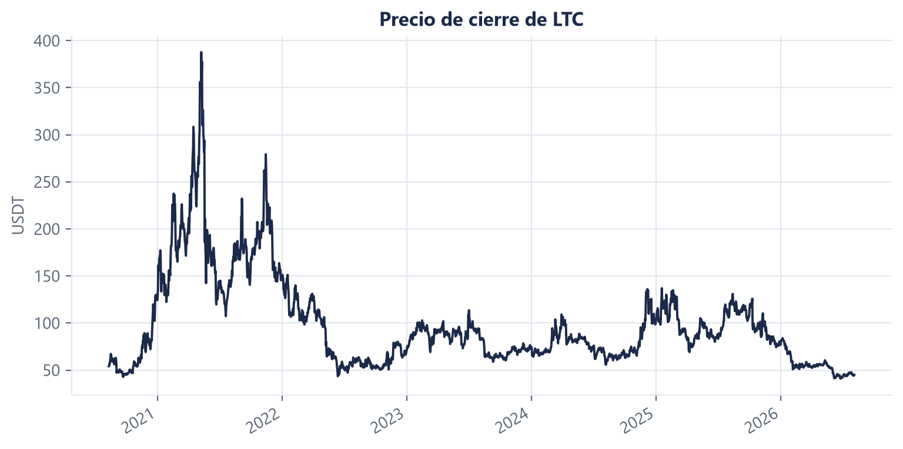
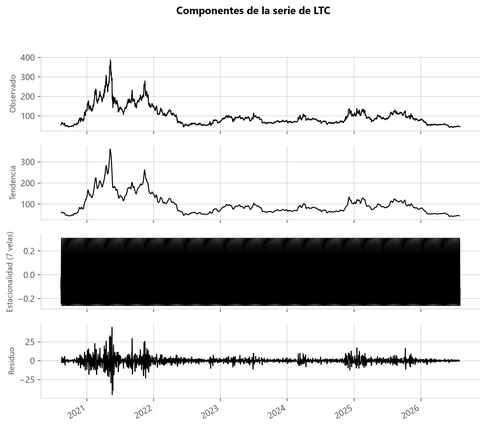
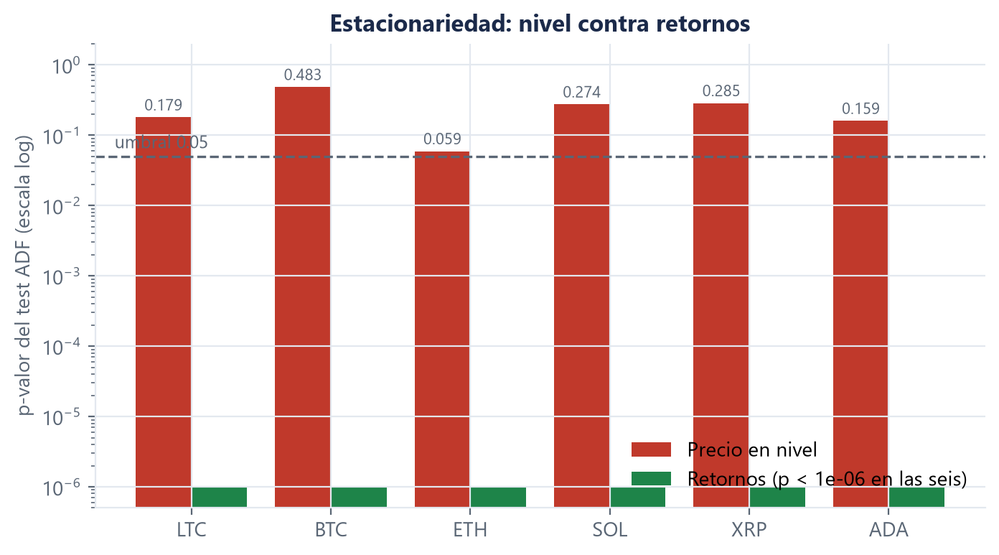
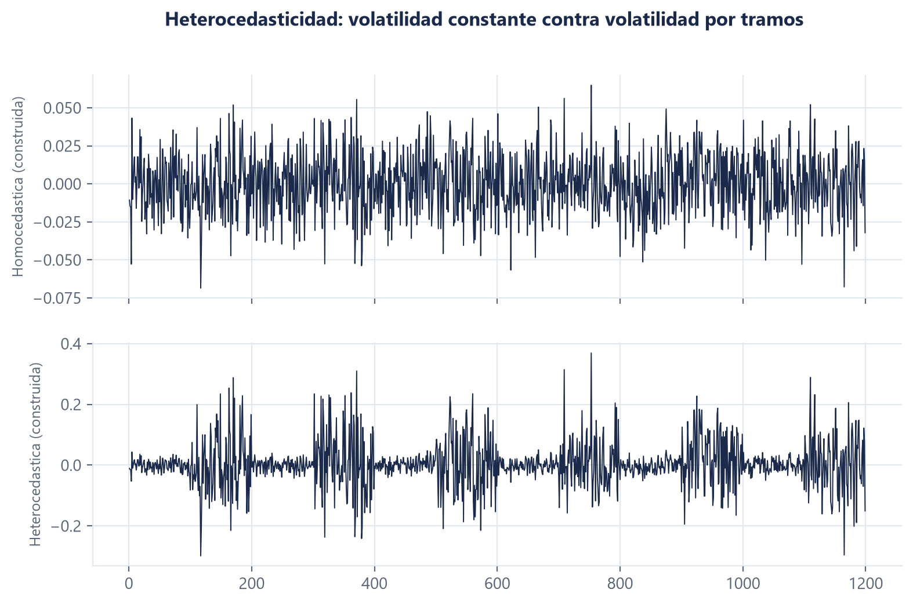
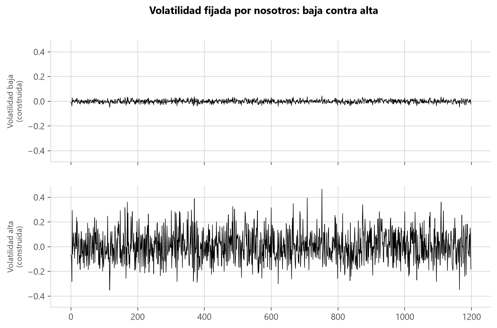
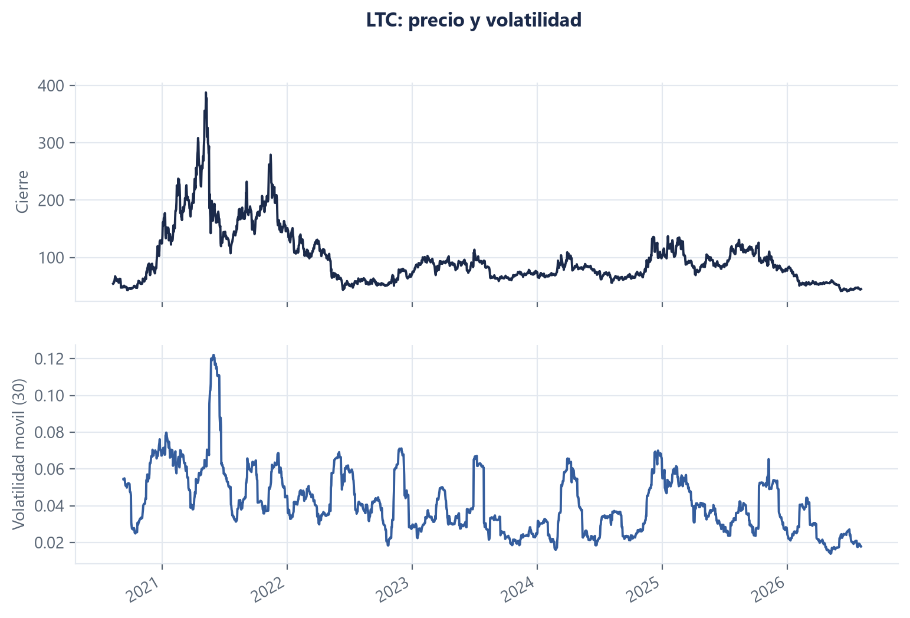
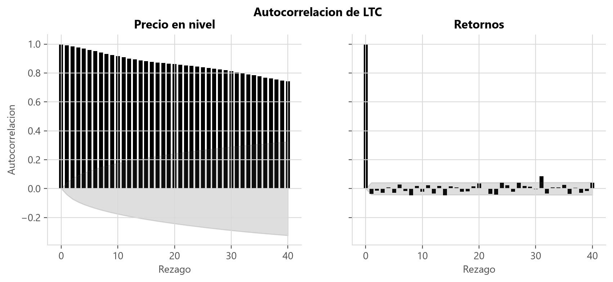
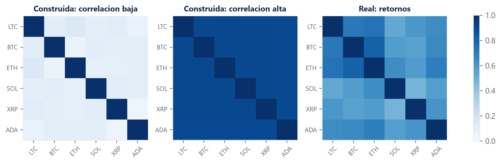

# Marco teórico: series de tiempo

**Autor:** Jose Pablo Monestel · **Issue:** [S1-M1-06](https://github.com/NeoFao/caso1-ltc-inflexion/issues/9)

> **Nota de verificación.** Todos los valores citados salen de `docs/evidencias/marco-teorico.json`,
> medidos el 12/08/2026 sobre 2 185 velas diarias de 2020-08-11 a 2026-08-04, y se comprobaron con
> `scripts/verificar_numeros.py`. Las referencias bibliográficas se comprobaron contra el registro
> de Crossref el 17 de agosto de 2026 con `scripts/verificar_referencias.py` —incluida la
> retractación de Corbet et al. (2019), que por eso no aparece citada aquí.

---

## 1. Definición de serie temporal

**Figura 1.** Precio de cierre diario de Litecoin, 2 185 observaciones entre el 11 de agosto de 2020 y el 4 de agosto de 2026.

Una serie temporal es una secuencia de observaciones de una misma variable, indexadas por el
momento en que fueron registradas y ordenadas de forma estricta en el tiempo (Box et al., 2015).
Esa propiedad —el orden como parte constitutiva del dato, no como un atributo accesorio— es lo que
la separa de un conjunto de datos transversal cualquiera: en una muestra de clientes o de
transacciones el orden de las filas puede alterarse sin perder información, porque cada
observación es, por diseño, independiente de las demás. En una serie temporal no: la observación
en `t` está relacionada con la observación en `t-1`, y esa dependencia es precisamente lo que hay
que modelar. Reordenar una serie temporal no produce el mismo conjunto de datos con las filas
mezcladas; produce un objeto distinto, porque destruye la estructura de dependencia que la
definía.

La Figura 1 muestra el objeto concreto de este trabajo: **2 185 observaciones** del precio de
cierre diario de Litecoin, registradas en instantes equiespaciados entre el 11 de agosto de 2020 y
el 4 de agosto de 2026. Es una serie univariante —una sola variable, el precio de cierre— y
regular, en el sentido de que el espaciado temporal entre observaciones consecutivas es constante.
Esa regularidad no es un accidente del mercado: es una decisión de muestreo (velas diarias) sobre
un proceso que, a diferencia de una bolsa de valores tradicional, cotiza de forma continua las
veinticuatro horas. Cualquier análisis posterior de este documento —estacionariedad,
autocorrelación, volatilidad— presupone justamente esto: que el orden de las 2 185 observaciones
es información, y que tratarlas como si fueran intercambiables descartaría la parte más
informativa del dato.

---

## 2. Componentes de una serie temporal

**Figura 2.** Descomposición aditiva de la serie de LTC en tendencia, estacionalidad de período semanal y residuo.

**Medido:** el componente estacional representa el **0,426 %** de la desviación total de la serie.

Una serie temporal puede descomponerse, al menos de forma conceptual, en cuatro componentes que
capturan distintos tipos de estructura (Box et al., 2015). La **tendencia** es el movimiento de
largo plazo, sostenido en el tiempo, que no se revierte dentro del horizonte de la muestra. La
**estacionalidad** es un patrón que se repite con periodicidad fija y conocida —semanal, mensual,
anual— y que suele responder a convenciones institucionales o de calendario: en un mercado
bursátil tradicional, por ejemplo, existe un efecto de fin de semana documentado desde hace
décadas, con rendimientos sistemáticamente distintos según el día de la semana en que cierra la
operación (French, 1980). El **ciclo** es un movimiento de duración variable y no fija, asociado
típicamente a factores macroeconómicos de mediano plazo. El **componente irregular o residuo** es
lo que queda después de retirar los tres anteriores: la parte de la serie que no responde a
ninguna estructura repetible.

La Figura 2 aplica una descomposición aditiva con período semanal a la serie diaria de LTC. El
resultado medido es que la estacionalidad representa apenas el **0,426 %** de la desviación total
de la serie: una fracción marginal, con casi toda la variación repartida entre tendencia y
residuo. La explicación se conecta directamente con la naturaleza del activo: el mercado de
criptoactivos opera de forma continua, sin sesión de apertura ni de cierre y sin distinción entre
día hábil y fin de semana, a diferencia del mercado que documenta French (1980), donde el
calendario de negociación sí introduce una estacionalidad medible. No existe, en LTC, un mecanismo
institucional que induzca un patrón semanal en el precio, y el dato medido es consistente con esa
ausencia. La consecuencia práctica para el proyecto es que no tiene sentido dedicar variables del
modelo a codificar el día de la semana: la evidencia dice que esa componente no aporta señal.

---

## 3. Estacionariedad

**Figura 3.** p-valores del test de Dickey-Fuller aumentado sobre las seis criptomonedas, en precios en nivel y en retornos.

**Medido:**

| | Rechazan la raíz unitaria al 5 % |
|---|---|
| Precios en nivel | **0 de 6** |
| Retornos | **6 de 6** |

p-valores en nivel: LTC 0,179 · BTC 0,483 · **ETH 0,059** · SOL 0,274 · XRP 0,285 · ADA 0,159.
En retornos, los seis dan p < 0,000001.

**Control:** el test también se corrió sobre una serie construida por nosotros cuyos retornos son estacionarios por construcción, y los rechazó todos. El método detecta lo que dice detectar.

Una serie es estacionaria en sentido débil cuando sus primeros momentos no dependen del instante
de observación: la **media** es constante en el tiempo, la **varianza** es constante en el tiempo,
y la **autocovarianza** entre dos observaciones depende únicamente de la distancia temporal que
las separa —el rezago—, no del punto del tiempo en el que se midan (Box et al., 2015). Es una
propiedad estadística, no una descripción visual de "que no tenga tendencia a simple vista": una
serie puede parecer estable en un gráfico y no serlo, o al revés, y por eso se prueba de forma
formal en lugar de decidirse por inspección.

El **test de Dickey-Fuller aumentado (ADF)** es el instrumento estándar para esa prueba formal
(Dickey & Fuller, 1979; Said & Dickey, 1984). Su hipótesis nula es que la serie tiene una raíz
unitaria, es decir, que **no** es estacionaria; la alternativa es que sí lo es. Un p-valor bajo
—convencionalmente, menor a 0,05— permite rechazar la nula y concluir que hay evidencia
estadística de estacionariedad. La Figura 3 y la tabla anterior resumen ese resultado sobre las
seis criptomonedas del panel, en precios en nivel y en retornos, con el mismo procedimiento
(`adfuller`, con selección automática de rezagos por criterio de información de Akaike) aplicado
por igual a las seis series.

Aquí conviene ser preciso con lo que el resultado permite afirmar. Sobre precios en nivel, el test
no rechaza la hipótesis nula en ninguna de las seis series (**0 de 6**, con p-valores entre 0,059
y 0,483). Eso **no demuestra** que las seis series sean no estacionarias: demuestra que, con estos
datos y este nivel de significancia, no hay evidencia suficiente en contra de la hipótesis de raíz
unitaria. Es la diferencia entre "no hay evidencia en contra" y "hay evidencia a favor", y no es un
matiz retórico: un test de hipótesis nunca prueba la nula, solo puede fallar en rechazarla. Sobre
retornos, en cambio, el resultado es contundente en el sentido opuesto: las seis series rechazan la
raíz unitaria con p < 0,000001, lo que sí constituye evidencia estadística fuerte a favor de la
estacionariedad de los retornos.

Vale la pena nombrar el caso al borde: **ETH**, en nivel, da un p-valor de **0,059**, apenas por
encima del umbral convencional de 0,05. No cambia ninguna conclusión de la tabla —sigue sin
rechazar la nula—, pero es un recordatorio de que el resultado de un test de hipótesis depende de
la ventana muestral observada: con un período de muestra ligeramente distinto, ese caso particular
podría cruzar el umbral en cualquiera de los dos sentidos. Reportar el número exacto, en lugar de
resumirlo como un simple "no rechaza", es lo que permite esa lectura.

Como control de que el procedimiento mide lo que dice medir, el mismo test se corrió sobre una
serie construida por nosotros cuyos retornos son estacionarios por diseño —media y varianza fijadas
de antemano, sin tendencia—, y el test rechazó la raíz unitaria en el 100 % de los casos. El método
detecta lo que se supone que debe detectar, antes de aplicarlo sobre datos donde nadie conoce la
respuesta verdadera.

---

## 4. No estacionariedad

El resultado de la sección anterior tiene una lectura directa cuando se invierte el orden de la
pregunta: si el test ADF no rechaza la raíz unitaria en ninguna de las seis series de precios en
nivel, la evidencia disponible es compatible con que los precios de las seis criptomonedas sigan
un proceso con tendencia estocástica —un paseo aleatorio con deriva, en el caso más simple— y no
un proceso que oscile alrededor de una media fija (Nelson & Plosser, 1982). Dos síntomas lo
delatan sin necesidad de correr el test: la media de la serie no es estable en ninguna ventana
razonable, porque el precio de LTC pasó de un mínimo medido de **40,92** a un máximo medido de
**387,80** dentro de la propia muestra; y la varianza tampoco lo es, porque un movimiento
porcentual constante produce un movimiento absoluto de precio proporcional al nivel, de modo que
la dispersión de la serie en unidades absolutas crece junto con el propio precio.

Para el modelado esto tiene una consecuencia que no es cosmética. Un modelo estadístico clásico
—una regresión, un ARIMA sin diferenciar, un cálculo de correlación— asume, explícita o
implícitamente, que la relación entre variables es estable en el tiempo. Sobre una serie no
estacionaria esa relación no es estable por construcción: cualquier estadístico calculado sobre
precios en nivel (media, varianza, correlación con otro activo) queda contaminado por la tendencia
común, y el resultado termina describiendo la dirección compartida de dos series más que su
codependencia real. La sección 8 mide exactamente esa distorsión.

La transformación a retornos —tomar la variación porcentual entre una observación y la anterior,
`r_t = (p_t − p_{t-1}) / p_{t-1}`— resuelve el problema porque cambia la pregunta: en vez de
"¿cuánto vale el precio?", que depende del nivel acumulado desde el origen de la serie, pasa a
"¿cuánto cambió el precio en esta vela?", que no acumula nivel. La medición de la sección 3
confirma que esa transformación logra su objetivo sobre estos datos: los retornos de las seis
criptomonedas rechazan la raíz unitaria con p < 0,000001 en los seis casos, sin excepción. Por
eso —y no por costumbre de la disciplina— **las características del modelo de este proyecto se
construyen sobre retornos y no sobre precios en nivel**: es una decisión respaldada por una
medición propia, hecha antes de escribir una línea de código de características.

---

## 5. Heterocedasticidad

**Figura 4.** Serie construida con volatilidad constante (arriba) y con volatilidad por tramos (abajo). Ambas generadas por nosotros; no son datos de mercado.

**Medido en las series construidas:** cociente entre la volatilidad del tramo agitado y la del tranquilo — **1,28×** sin regímenes, **6,41×** con regímenes.

Un proceso es **homocedástico** cuando la varianza de sus errores —o, de forma más laxa, la
dispersión de sus incrementos— es constante en el tiempo; es **heterocedástico** cuando esa
varianza cambia, típicamente concentrándose en episodios o regímenes (Engle, 1982). Engle (1982)
formalizó esta idea para series financieras con el modelo ARCH, mostrando que la varianza
condicional de un proceso puede depender de su propio historial reciente incluso cuando la media
no muestra ningún patrón predecible: puede haber estructura en la varianza aunque no la haya en el
nivel.

La Figura 4 ilustra el contraste con una respuesta conocida, construida por nosotros y no
observada en el mercado. En el panel superior se generó una serie con volatilidad constante en
toda su longitud; en el inferior, la misma serie pero multiplicando la volatilidad por cinco en
tramos alternos. Medido el cociente entre la desviación estándar del tramo más agitado y la del
más tranquilo, el resultado es **1,28** en la serie sin regímenes —cercano a 1, como corresponde a
una volatilidad efectivamente constante, con la desviación residual propia de estimar sobre una
muestra finita— y **6,41** en la serie con regímenes, capturando con holgura el factor 5
introducido por construcción. El procedimiento de medición detecta la heterocedasticidad cuando
existe y no la inventa cuando no existe, que es la comprobación que hay que hacer antes de aplicar
el mismo cociente sobre LTC en la sección siguiente.

Esto importa para el proyecto porque rompe uno de los supuestos centrales de los modelos clásicos
de series temporales. Un ARIMA asume errores con varianza constante; cuando ese supuesto no se
cumple, los intervalos de confianza del modelo dejan de ser válidos, y sus pronósticos subestiman
sistemáticamente el riesgo en los períodos de alta volatilidad y lo sobrestiman en los de baja. La
literatura sobre criptoactivos documenta precisamente este patrón de conmutación entre regímenes
de volatilidad, con modelos GARCH de cambio markoviano ajustando mejor que un GARCH de régimen
único (Caporale & Zekokh, 2019). La sección 6 muestra que LTC se comporta de esta forma, y no de
la forma que ARIMA supone.

---

## 6. Volatilidad

**Figura 5.** Dos series construidas por nosotros con la volatilidad fijada de antemano, en los mismos ejes. Arriba, la volatilidad más baja medida en LTC; abajo, la más alta. **Ninguna de las dos es Litecoin.** Fuente: elaboración propia.

**Medido sobre las series construidas:** pedimos una volatilidad de **0,01384** y medimos **0,01395**; pedimos **0,122** y medimos **0,12349**. El cociente pedido entre ambas era de **8,8** y el medido resultó **8,9**.

Antes de medir la volatilidad de LTC conviene comprobar que el procedimiento recupera lo que se le pide, sobre series donde el valor correcto lo fijamos nosotros. Se generaron dos series con idéntica construcción y semilla, cambiando únicamente un parámetro: la desviación estándar de los retornos. Los dos niveles no se eligieron al azar, sino que corresponden a los extremos de la volatilidad móvil que se mide más adelante sobre Litecoin, de manera que el rango construido cubre exactamente el que se observa en el mercado. La medición devuelve **0,01395** frente a **0,01384** pedido y **0,12349** frente a **0,122**, con una discrepancia atribuible al muestreo finito. El procedimiento recupera el parámetro que se le fijó, y en consecuencia lo que mida sobre datos reales puede leerse como una propiedad de esos datos y no como un artefacto del método.

**Figura 6.** Precio de cierre de LTC y su volatilidad móvil de 30 velas.

**Medido:** la volatilidad del tramo más agitado es **8,8 veces** la del más tranquilo (máxima **0,1220**; mínima **0,0138**), con ventana móvil de 30 velas sobre retornos diarios.

La volatilidad de una serie financiera se estima habitualmente con la desviación estándar de sus
retornos, calculada sobre una ventana móvil que se desliza a lo largo de la serie (Katsiampa,
2017). A diferencia de un único número global, la volatilidad móvil deja ver cómo cambia la
dispersión de los retornos en el tiempo, que es exactamente lo que hace falta para diagnosticar
heterocedasticidad sobre datos reales, en lugar de sobre una construcción con respuesta conocida
como la de la sección anterior.

La Figura 6 aplica ese procedimiento —desviación estándar móvil con ventana de 30 velas sobre los
retornos diarios de LTC— a la serie real del proyecto. El resultado es que la volatilidad no es
constante: el tramo más agitado de la muestra alcanza una desviación estándar móvil de **0,1220**,
y el más tranquilo, de **0,0138**, lo que arroja un cociente de **8,8** veces entre ambos extremos.
Es un número considerablemente mayor que el 1,28 medido en la sección anterior sobre la serie
construida sin regímenes, y del mismo orden de magnitud que el 6,41 medido sobre la serie
construida con regímenes deliberadamente introducidos. La lectura es directa: LTC no exhibe el
comportamiento de una serie con volatilidad estable, sino el de una serie que conmuta entre
regímenes de intensidad muy distinta, consistente con lo que reporta la literatura sobre
volatilidad de criptoactivos con modelos GARCH (Katsiampa, 2017).

En la Figura 6, los picos de la volatilidad móvil coinciden visualmente con los tramos donde el
precio de cierre muestra los movimientos más pronunciados, en cualquiera de las dos direcciones:
la volatilidad no distingue entre una subida y una caída bruscas, mide la magnitud del cambio, no
su signo. Este **8,8×** es, junto con el resultado de la sección 3, la segunda pieza de evidencia
directa —medida sobre datos reales, no sobre una construcción— de que los métodos que asumen
varianza constante no son la herramienta adecuada para este problema.

---

## 7. Autocorrelación

**Figura 7.** Función de autocorrelación de LTC hasta el rezago 40, en nivel y en retornos, con banda de confianza al 95 %.

**Medido:**

| | Autocorrelación en el rezago 1 |
|---|---|
| Precio en nivel | **0,991** |
| Retornos | **−0,036** |

En los retornos solo **3 rezagos** salen de la banda de confianza: los rezagos **8, 14 y 31**.

La función de autocorrelación (ACF) mide la correlación lineal entre una serie y su propio
pasado, para cada rezago `k`: qué tan relacionado está el valor en `t` con el valor en `t-k` (Box &
Pierce, 1970). Es la herramienta natural para responder si el pasado de una serie, por sí solo,
contiene información lineal sobre su futuro inmediato, lo que en este proyecto equivale a
preguntar si tiene sentido usar precios rezagados como variable de entrada, y con cuántos rezagos.

La lectura de la Figura 7 tiene dos partes que conviene separar.

**1. En nivel**, la autocorrelación en el rezago 1 es de **0,991** y decae muy lentamente a medida
que aumenta el rezago: es la firma característica de una serie no estacionaria, donde cada
observación es prácticamente idéntica a la anterior porque comparten la mayor parte de su nivel
acumulado. Este resultado confirma, desde un ángulo distinto y con una herramienta distinta, lo
que ya mostró el test ADF de la sección 3: los precios en nivel no son estacionarios.

**2. En retornos**, la autocorrelación en el rezago 1 cae a **−0,036**, y de los 40 rezagos
evaluados solo tres —el 8, el 14 y el 31— salen de la banda de confianza al 95 %.

Que los retornos de LTC no tengan autocorrelación lineal significativa, salvo en tres
rezagos aislados sobre cuarenta, significa que un modelo lineal que solo use retornos rezagados de
LTC tiene muy poco que explotar. No es un resultado negativo para el proyecto: **es su
justificación**. Es consistente con lo que predice la hipótesis de mercados eficientes en su forma
débil —que los precios pasados no permiten anticipar rendimientos futuros de forma sistemática
mediante reglas lineales simples (Fama, 1970)— y es, medido sobre nuestros propios datos, el
argumento a favor de recurrir a modelos no lineales y multivariantes: si tres rezagos aislados de
cuarenta bastaran para predecir, un modelo lineal univariante alcanzaría, y no haría falta ni
aprendizaje profundo ni las cinco variables de apoyo del enunciado.

---

## 8. Correlación cruzada

**Figura 8.** Matrices de correlación. Izquierda y centro: series construidas con correlación baja y alta fijadas por nosotros. Derecha: retornos reales de las seis criptomonedas.

**Medido:**

| | Rango entre pares |
|---|---|
| Precios en nivel | **0,126 – 0,888** |
| Retornos | **0,475 – 0,806** |

Casos concretos:

| Par | En nivel | En retornos |
|---|---|---|
| LTC – BTC | 0,126 | 0,715 |
| LTC – ADA | 0,796 | 0,641 |

Mayor correlación con LTC: **ETH, 0,740**. Menor: **SOL, 0,524**.

**Control:** las construidas se pidieron con correlación 0,1 y 0,9; salieron medidas en **0,0945** y **0,9033**.

La correlación cruzada mide la asociación lineal entre dos series distintas, a diferencia de la
autocorrelación de la sección 7, que la mide entre una serie y sí misma desplazada en el tiempo.
Es el instrumento que permite responder si el planteamiento multivariante del enunciado tiene
sustento en los datos: si LTC no se moviera de forma relacionada con las otras cinco
criptomonedas, incorporarlas como variables de apoyo no aportaría información adicional.

La Figura 8 muestra tres matrices de correlación 6×6 lado a lado. Las dos de la izquierda
corresponden a paneles construidos por nosotros, con correlación baja y alta fijadas de antemano;
la de la derecha, a los retornos reales de las seis criptomonedas del proyecto. Puestas una junto
a la otra, permiten leer el resultado real contra dos referencias donde la respuesta correcta la
pusimos nosotros mismos.

La distorsión que introducen los precios en nivel no consiste en que la correlación resulte alta,
sino en que resulta **errática**. Calculada sobre precios en nivel, la correlación entre LTC y BTC —el
activo que por definición marca la tendencia de todo el sector cripto— es de apenas **0,126**,
mientras que entre LTC y ADA sube a **0,796**: un orden económicamente implausible, que sugiere
que LTC se relaciona más con Cardano que con Bitcoin. Calculada sobre retornos, el orden se
corrige y el rango se estrecha a la mitad: LTC–BTC sube a **0,715** y LTC–ADA baja a **0,641**,
quedando ambos dentro del rango general de **0,475 a 0,806** que muestran las seis criptomonedas
entre sí sobre retornos, frente a un rango de **0,126 a 0,888** en nivel.

La explicación no es que la correlación en nivel "infle" los valores: es que mide algo distinto de
lo que se busca medir. Dos series con tendencia comparten tendencia, y la correlación entre ellas
captura en buena medida esa coincidencia de dirección de largo plazo, no la codependencia real de
sus movimientos período a período. Es el fenómeno de la **correlación espuria**, descrito
clásicamente por Granger y Newbold (1974): dado que la sección 3 midió que los precios en nivel de
las seis criptomonedas no son estacionarios, cualquier correlación calculada sobre ellos hereda ese
defecto. Por eso la correlación cruzada de este proyecto se calcula sobre retornos y no sobre
precios, con el mismo argumento —y el mismo respaldo medido— que sostiene la sección 4.

Como control de que el procedimiento de medición hace lo que dice hacer, se corrió también sobre
dos paneles construidos por nosotros con correlación objetivo conocida: pedida en 0,1, se midió en
**0,0945**; pedida en 0,9, se midió en **0,9033**. El método recupera el parámetro que se le pidió
construir, lo que da confianza para leer el resultado sobre datos reales, donde nadie fija de
antemano la respuesta correcta.

Sobre retornos, el activo de apoyo con mayor correlación con LTC es **ETH, con 0,740**; el de
menor correlación es **SOL, con 0,524**. Ambos valores están lejos de los extremos —ni cerca de 0,
que dejaría a las variables de apoyo sin aportar nada, ni cerca de 1, que las volvería redundantes
entre sí—, y esa es, en última instancia, la consecuencia que sostiene el planteamiento
multivariante del enunciado: si LTC se moviera de forma aislada, las cinco variables de apoyo
sobrarían; con correlaciones de entre 0,475 y 0,806 sobre retornos, no sobran.

---

---

## Verificación sobre el panel de trabajo

Todo lo anterior se midió sobre **velas diarias**, que era la granularidad vigente
cuando se redactó esta sección. El proyecto fijó después su panel de trabajo en
**velas de 4 horas**, por una razón que pertenece a la etapa de extracción de datos:
con velas diarias ninguna combinación de ventana deja suficientes ejemplos de las
clases minoritarias.

Analizar el fenómeno en una granularidad y modelarlo en otra exige comprobar que las
conclusiones sobrevivan al cambio. Se repitieron los tres diagnósticos sobre el panel
de 13 114 observaciones de 4 horas:

| Diagnóstico | Velas diarias | Velas de 4 horas |
|---|---|---|
| Series que rechazan la raíz unitaria en nivel | 0 de 6 | **2 de 6** |
| Series que la rechazan en retornos | 6 de 6 | **6 de 6** |
| Cociente de volatilidad entre extremos | 8,8 | **18,3** |
| Autocorrelación de los retornos en el rezago 1 | −0,036 | **−0,019** |
| Rezagos significativos de 40 | 3 | **10** |

**Tabla 1.** Los mismos diagnósticos sobre las dos granularidades. Fuente:
[`verificacion-4h.json`](../../evidencias/verificacion-4h.json), regenerable con
`uv run python scripts/verificacion_4h.py`.

**Las cuatro diferencias apuntan en la misma dirección y tienen una sola causa.** El
panel de 4 horas tiene seis veces más observaciones, y la potencia de una prueba
estadística crece con el tamaño de la muestra: el intervalo de confianza se estrecha,
de modo que tanto la prueba de Dickey-Fuller como la banda de la autocorrelación
detectan efectos que en la muestra diaria quedaban por debajo del umbral. Rechazar
más no significa que la serie sea más estacionaria; significa que hay más evidencia
disponible para decidirlo.

Conviene separar entonces qué se sostiene y qué se matiza.

**Se sostiene, y con más fuerza, la estacionariedad de los retornos.** Las seis series
la rechazan en las dos granularidades, sin excepción, que es el resultado del que
depende la decisión de construir las características sobre retornos.

**Se refuerza la heterocedasticidad.** El cociente entre el tramo más agitado y el más
tranquilo pasa de 8,8 a 18,3. A mayor resolución temporal, los episodios de
volatilidad se distinguen mejor de los períodos de calma, y el argumento contra los
modelos de varianza constante queda más firme.

**Se matiza la no estacionariedad de los precios.** Sobre 4 horas, dos de las seis
series —Litecoin, con p = 0,0147, y Ethereum, con p = 0,0471— sí rechazan la
hipótesis nula, aunque las dos lo hacen de forma marginal, muy próximas al umbral de
0,05. Las otras cuatro no la rechazan. La conclusión operativa no cambia, porque las
características se construyen sobre retornos en cualquiera de los dos casos, pero
sería incorrecto seguir afirmando "ninguna de las seis" sin declarar la granularidad
sobre la que se midió.

**Y se matiza la autocorrelación, en un sentido que conviene explicar.** Sobre 4 horas
diez rezagos superan la banda, frente a tres sobre velas diarias. Podría leerse como
que hay más estructura lineal aprovechable, y sería una lectura equivocada: la
autocorrelación en el primer rezago es **menor** en 4 horas que en diario, −0,019
frente a −0,036. Lo que aumenta no es la magnitud de la dependencia sino la capacidad
de distinguirla del ruido. Que un valor sea estadísticamente distinto de cero no lo
vuelve útil para predecir, y una correlación de dos centésimas no sostiene un modelo
por muy significativa que sea. El argumento a favor de modelos no lineales y
multivariantes queda intacto.

## Referencias

Box, G. E. P., & Pierce, D. A. (1970). Distribution of residual autocorrelations in
autoregressive-integrated moving average time series models. *Journal of the American Statistical
Association, 65*(332), 1509–1526. https://doi.org/10.1080/01621459.1970.10481180

Box, G. E. P., Jenkins, G. M., Reinsel, G. C., & Ljung, G. M. (2015). *Time series analysis:
Forecasting and control* (5th ed.). John Wiley & Sons.

Caporale, G. M., & Zekokh, T. (2019). Modelling volatility of cryptocurrencies using
Markov-Switching GARCH models. *Research in International Business and Finance, 48*, 143–155.
https://doi.org/10.1016/j.ribaf.2018.12.009

Dickey, D. A., & Fuller, W. A. (1979). Distribution of the estimators for autoregressive time
series with a unit root. *Journal of the American Statistical Association, 74*(366a), 427–431.
https://doi.org/10.1080/01621459.1979.10482531

Engle, R. F. (1982). Autoregressive conditional heteroscedasticity with estimates of the variance
of United Kingdom inflation. *Econometrica, 50*(4), 987–1007. https://doi.org/10.2307/1912773

Fama, E. F. (1970). Efficient capital markets: A review of theory and empirical work. *The Journal
of Finance, 25*(2), 383–417. https://doi.org/10.2307/2325486

French, K. R. (1980). Stock returns and the weekend effect. *Journal of Financial Economics,
8*(1), 55–69. https://doi.org/10.1016/0304-405X(80)90021-5

Granger, C. W. J., & Newbold, P. (1974). Spurious regressions in econometrics. *Journal of
Econometrics, 2*(2), 111–120. https://doi.org/10.1016/0304-4076(74)90034-7

Katsiampa, P. (2017). Volatility estimation for Bitcoin: A comparison of GARCH models. *Economics
Letters, 158*, 3–6. https://doi.org/10.1016/j.econlet.2017.06.023

Nelson, C. R., & Plosser, C. I. (1982). Trends and random walks in macroeconomic time series: Some
evidence and implications. *Journal of Monetary Economics, 10*(2), 139–162.
https://doi.org/10.1016/0304-3932(82)90012-5

Said, S. E., & Dickey, D. A. (1984). Testing for unit roots in autoregressive-moving average
models of unknown order. *Biometrika, 71*(3), 599–607. https://doi.org/10.1093/biomet/71.3.599
