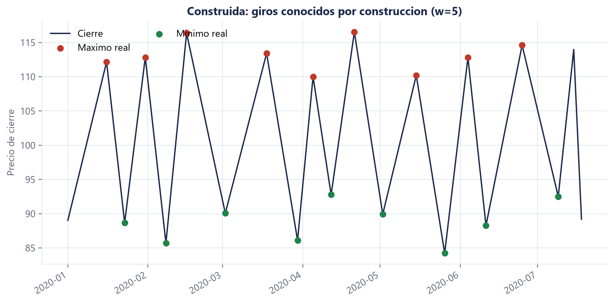
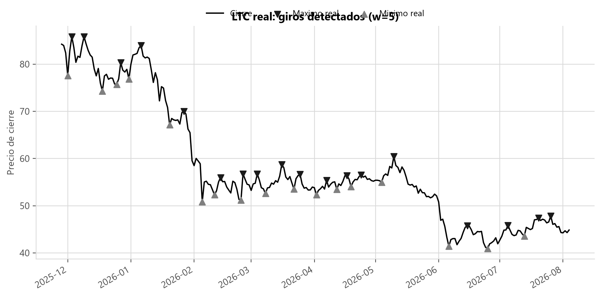
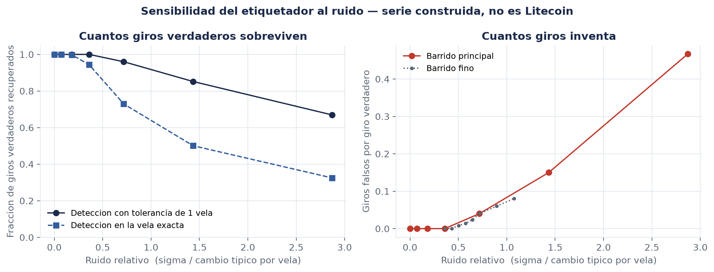
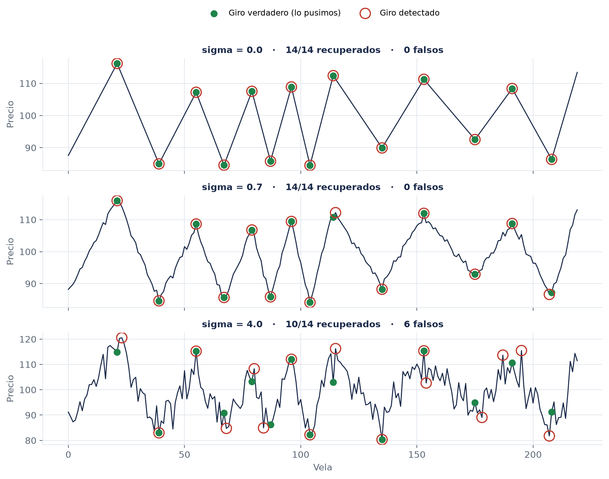

# Marco teórico: criptoactivos y sus características

**Autor:** Alejandro Zamora · **Issue:** [S1-M2-05](https://github.com/NeoFao/caso1-ltc-inflexion/issues/13)

> **Nota para el ensamblaje (Fabrizio).** La numeración de figuras es local a esta sección
> (Figura 1 a Figura 5). Al unir los tres archivos hay que renumerarlas de corrido y ajustar las
> referencias del texto. Las referencias bibliográficas están al final en APA 7; **falta
> verificar volumen, páginas y DOI de cada una contra la fuente antes de la entrega definitiva**.
>
> El noveno punto del enunciado — métricas de evaluación — va en [`m2-metricas.md`](m2-metricas.md).

---

## 1. Definición de criptoactivo

Un criptoactivo es una representación digital de valor que se registra, se transfiere y se
almacena mediante criptografía sobre un registro distribuido, y cuya validez no depende de que
una entidad central certifique cada operación. El Grupo de Acción Financiera Internacional lo
define de forma funcional, como una representación digital de valor susceptible de ser negociada
o transferida electrónicamente y utilizable para pago o inversión (Financial Action Task Force
[FATF], 2021). Esa definición
—qué hace el activo, no quién lo emite— es la que conviene adoptar en un trabajo cuantitativo.

Lo que distingue a un criptoactivo de un activo financiero tradicional no es que sea digital: un
depósito bancario también lo es. La diferencia está en **quién garantiza el registro**. En un
activo tradicional existe un intermediario —banco, depositaria de valores, cámara de
compensación— cuyo libro contable es la fuente de verdad, y la propiedad del activo es una
anotación en ese libro. En un criptoactivo el libro está replicado por una red de participantes
que acuerdan su contenido mediante un protocolo de consenso, de modo que la propiedad se prueba
con una clave criptográfica y no con la palabra de un custodio (Nakamoto, 2008; Narayanan et al.,
2016).

De ahí se deriva la propiedad que más importa para este trabajo: **no existe un emisor con
obligación de pago**. Un bono tiene un flujo contractual; una acción, un derecho residual sobre
las utilidades. Un criptoactivo no tiene ninguno de los dos y carece, por lo tanto, de un anclaje
de valoración fundamental comparable. Böhme et al. (2015) señalan que su precio se determina
enteramente por el equilibrio entre quienes desean adquirirlo y quienes desean desprenderse de
él, sin un valor de referencia externo que ancle las expectativas.

Esa ausencia de ancla es la razón técnica por la que este proyecto se plantea como un problema de
**reconocimiento de patrones sobre la serie de precios** y no como un problema de valoración. No
hay un múltiplo al que el precio deba revertir; hay una serie temporal cuya dinámica hay que
caracterizar. Y es también la razón por la que el enunciado exige un enfoque multivariante: si no
hay fundamentales que expliquen el precio de LTC, buena parte de la información disponible está
en cómo se comportan los demás criptoactivos.

---

## 2. Características principales

**Descentralización del registro.** Ningún participante puede modificar unilateralmente el
historial de transacciones. Esto tiene una consecuencia práctica para nosotros: no existe un
precio oficial emitido por una autoridad. Cada exchange forma su propio precio, y elegir la
fuente es una decisión metodológica que hay que declarar (sección 4).

**Operación continua.** El mercado funciona las veinticuatro horas, los siete días de la semana,
sin sesión de apertura ni de cierre. Esta característica del activo se ve directamente en
nuestros datos: la descomposición de la serie diaria de LTC realizada por M1 atribuye a la
componente estacional apenas el **0,426 %** de la variación total. En un mercado con horario
—una bolsa de valores— aparecería un efecto de fin de semana y un patrón intrasemanal
apreciable; aquí, prácticamente no hay ninguno.

No es un detalle descriptivo: **justifica una decisión de diseño**. Al no haber estacionalidad
relevante, no tiene sentido gastar características del modelo en codificar el día de la semana o
la posición dentro del mes, y ese presupuesto queda disponible para variables que sí informan. Es
un caso donde una propiedad institucional del activo se traduce en una medición, y la medición se
traduce en una decisión del pipeline.

**Divisibilidad.** Un criptoactivo se fracciona hasta ocho decimales o más, de manera que no
existe un tamaño mínimo de operación comparable al lote de una acción. Para el modelado esto
implica que la serie de precios no presenta discretización artificial por tamaño de contrato.

**Transparencia del registro y opacidad del participante.** Todas las transacciones son públicas
y auditables, pero las direcciones no están asociadas a identidades. La consecuencia para el
análisis es que existe información en cadena (*on-chain*) potencialmente utilizable como variable
explicativa. En este proyecto no la usamos: el enunciado especifica los precios rezagados de las
seis criptomonedas como entrada, y ampliar el conjunto de fuentes sin una necesidad medida sería
aumentar la complejidad sin justificación.

**Ausencia de cierre diario.** La consecuencia técnica es que la vela diaria es un corte de reloj
convencional —00:00 UTC—, no un evento de mercado. Un cierre bursátil concentra órdenes y produce
un precio con significado institucional; un corte a medianoche UTC en cripto es una convención
del exchange. Esto refuerza la conveniencia de trabajar con velas de 4 horas: si el corte es
arbitrario de todos modos, la granularidad se elige por criterio estadístico —cuántos ejemplos
deja disponibles— y no por respeto a una convención que no significa nada.

**Volatilidad elevada y variable en el tiempo.** Sobre los datos del proyecto, la desviación
estándar móvil de los retornos de LTC en ventanas de 30 días recorre un rango de **0,0138 a
0,122**: el período más agitado de la muestra fue **8,8 veces** más volátil que el más tranquilo.
La literatura documenta este comportamiento de forma sistemática. Katsiampa (2017) compara
modelos GARCH sobre Bitcoin, y Caporale y Zekokh (2019) muestran, mediante modelos GARCH con
cambio de régimen markoviano, que la volatilidad de los criptoactivos no es solamente alta sino
que **conmuta entre estados** de alta y baja intensidad. Nuestro dato es consistente con esa
literatura y, sobre todo, es propio y medido. La implicación
metodológica es directa: la varianza de la serie no es constante, así que cualquier
característica construida sobre magnitudes absolutas de precio será inestable entre períodos. Por
eso el pipeline trabaja sobre retornos y sobre estadísticos normalizados por ventana.

---

## 3. Principales tipos

La clasificación por función económica es la más útil aquí, porque explica por qué las seis
criptomonedas del proyecto no son intercambiables entre sí:

**Monedas de pago.** Diseñadas como medio de intercambio, con funcionalidad programable
limitada. **LTC** —nuestro activo objetivo— pertenece a esta categoría: nació en 2011 como una
variante de Bitcoin con bloques más rápidos y una función de prueba de trabajo distinta,
orientada a transacciones de menor valor.

**Reserva de valor y activo de referencia.** **BTC** cumple hoy sobre todo esta función. Baur et
al. (2018) muestran que su uso predominante es especulativo y de tenencia antes que
transaccional, lo que lo aproxima más a un activo de inversión que a un medio de pago.

**Plataformas de contratos inteligentes (capa 1).** Redes cuyo valor deriva de la actividad que
alojan. **ETH** es la de mayor adopción; **SOL** compite ofreciendo mayor rendimiento
transaccional a cambio de supuestos de descentralización distintos; **ADA** sigue una ruta de
desarrollo más conservadora y por etapas.

**Orientados a pagos transfronterizos.** **XRP** apunta a la liquidación entre instituciones
financieras, y su valor está más expuesto que el de los demás a decisiones regulatorias sobre su
naturaleza jurídica.

**Stablecoins.** Mantienen paridad con una moneda fiduciaria mediante respaldo o mecanismos
algorítmicos. No forman parte de este estudio precisamente por eso: su precio es
aproximadamente constante por diseño, no tiene puntos de inflexión que pronosticar, y su serie no
aportaría información al problema.

La composición de la canasta importa. Las seis series no son seis observaciones independientes
del mercado cripto: son cuatro funciones económicas distintas, y esa heterogeneidad es lo que
hace que la correlación cruzada entre ellas —sección 6— pueda aportar información en lugar de ser
redundancia.

---

## 4. Mercado cripto

El mercado de criptoactivos se organiza en torno a **exchanges centralizados**, que operan libros
de órdenes con emparejamiento continuo, y a mercados descentralizados basados en contratos
inteligentes. La formación de precios sucede en cada plaza por separado; el arbitraje entre ellas
mantiene las cotizaciones alineadas, pero no las hace idénticas. No existe, a diferencia de los
mercados de valores regulados, un mecanismo de consolidación que produzca un precio único de
referencia.

**Decisión de fuente y su consecuencia.** Los precios de este trabajo provienen de la API pública
de Binance. Hay que declararlo explícitamente porque condiciona lo que los resultados significan:
son los precios de **un** exchange, no un promedio ponderado del mercado, y por lo tanto
incorporan la microestructura particular de esa plaza —su profundidad, su base de usuarios, sus
períodos de interrupción—. Un punto de inflexión detectado sobre esta serie es un punto de
inflexión en Binance. Dado que Binance concentra una parte sustancial del volumen de las seis
parejas contra USDT, es una aproximación razonable al precio de mercado, pero es una
aproximación, y así hay que reportarla.

**Ventana histórica común.** El panel del proyecto arranca el **11 de agosto de 2020** y no antes.
La razón es que la ventana común está determinada por el activo de listado más reciente: Solana
comienza a cotizar en esa fecha. Las coberturas individuales son mucho más amplias —LTC tiene
datos desde el 13 de diciembre de 2017 y BTC desde el 17 de agosto de 2017—, pero un panel
multivariante exige que las seis series existan simultáneamente en cada instante. Todo lo
anterior a esa fecha se descarta por incompleto.

El costo de esa decisión es cuantificable. Con velas diarias el panel queda en **2 185
observaciones** para el período 11/08/2020 – 04/08/2026, mientras que la serie individual de LTC
tiene 3 157: se sacrifica cerca de un tercio del historial para poder plantear el problema como
multivariante. Con velas de 4 horas el mismo período produce **13 114 observaciones**, y por eso
esa es la granularidad de trabajo. El requisito de simultaneidad se paga en historia, y la
granularidad más fina es lo que devuelve el volumen de ejemplos necesario.

La cobertura del panel de 4 horas es prácticamente completa: sobre los 13 114 instantes esperados
para SOL no hay ningún hueco, y los huecos de los demás activos en su historia completa van de 9
a 16 velas, esto es, menos del 0,1 %. La calidad del dato no es un supuesto: está medida en
[`docs/evidencias/spike-datos-4h.json`](../../evidencias/spike-datos-4h.json).

---

## 5. Factores que afectan el precio

**Oferta y demanda con oferta programada.** LTC tiene un tope de emisión de 84 millones de
unidades y un calendario de reducción de la recompensa por bloque —*halving*— aproximadamente cada
cuatro años. La oferta futura es conocida de antemano y no responde al precio, de modo que todo
el ajuste ocurre por el lado de la demanda. El efecto de los halvings sobre el precio es objeto de
debate: al tratarse de un evento anunciado, la hipótesis de mercados eficientes predice que ya
está incorporado en la cotización, aunque la evidencia sobre eficiencia en cripto es mixta
(Urquhart, 2016).

**Regulación.** Los anuncios regulatorios producen movimientos abruptos y sincronizados en todo el
sector. Auer y Claessens (2018) documentan que los precios reaccionan de forma marcada a noticias
sobre el tratamiento jurídico de los criptoactivos, con una respuesta diferenciada según el tipo
de anuncio. Para nuestro problema esto importa por una razón concreta: los saltos de precio
inducidos por noticias son **exógenos a la serie**. Ninguna característica construida a partir del
histórico de precios puede anticiparlos, y conviene decirlo antes de que lo pregunten: hay una
fracción irreducible de los puntos de inflexión que el modelo no puede predecir por construcción.

**Sentimiento y atención.** La ausencia de anclaje fundamental deja más espacio al componente de
expectativa, y hay evidencia cuantitativa de ello. Liu y Tsyvinski (2021) muestran que los
rendimientos de los criptoactivos no están expuestos a los factores de riesgo de acciones,
divisas ni materias primas, ni a las variables macroeconómicas habituales —es decir, que no se
les encuentra el anclaje fundamental por ningún lado—, y que en cambio sí resultan predichos de
forma robusta por el momento del precio y por medidas de atención del inversor, como el volumen
de búsquedas y de publicaciones en redes. Es la confirmación empírica del argumento de la
sección 1, y refuerza el planteamiento del proyecto: si los fundamentales no explican el precio,
lo que queda por explotar es la dinámica de la propia serie.

**Flujos institucionales y liquidez.** La entrada de vehículos de inversión regulados modificó la
base de participantes y, con ella, el régimen de volatilidad. Esto es coherente con la
heterocedasticidad medida en nuestra serie: el cociente de 8,8 entre el período más volátil y el
más tranquilo no describe un mercado con volatilidad alta y estable, sino uno que **cambia de
régimen**.

**Contagio entre activos.** Es el factor que justifica el diseño multivariante de este trabajo, y
por eso tiene sección propia. Ji et al. (2019) y Yi et al. (2018) documentan una red densa de
transmisión de retornos y de volatilidad entre criptoactivos, con Bitcoin en posición dominante
como emisor de choques.

La selección de las cinco variables de apoyo que hace el enunciado es consistente con esa
literatura: BTC como transmisor sistémico, ETH como segundo motor del sector, SOL como indicador
de actividad especulativa en capas 1 de alto rendimiento, XRP por su sensibilidad a lo
regulatorio, y ADA como reflejo de la rotación de capital entre plataformas. La sección siguiente
contrasta esa expectativa con lo que efectivamente miden nuestros datos.

---

## 6. Correlación y dependencia entre activos

**Figura 1.** Matriz de correlación entre las seis criptomonedas, calculada sobre retornos diarios
del panel 11/08/2020 – 04/08/2026 (n = 2 185). Fuente: elaboración propia sobre datos de Binance.

**Medido sobre retornos:** todas las parejas caen entre **0,475 y 0,806**, con una media fuera de
la diagonal de **0,625**. LTC se correlaciona más con **ETH (0,740)** y con **BTC (0,715)**, y
menos con **SOL (0,524)**.

M1 desarrolla en su sección la mecánica estadística de la correlación cruzada. Lo que sigue es la
interpretación económica.

**Por qué ETH y BTC encabezan la lista.** LTC nació como una variante técnica de Bitcoin y
comparte con él la función económica de moneda de pago; se negocia mayoritariamente en las mismas
plazas, contra los mismos pares, y ante los mismos flujos de noticias. BTC es además el activo de
referencia del sector: Ji et al. (2019) lo identifican como el principal emisor de choques de
retorno hacia el resto del mercado, de modo que un movimiento de BTC se propaga a LTC casi por
definición. ETH aparece incluso ligeramente por encima porque comparte con LTC el estatus de
activo de gran capitalización y alta liquidez, lo que lo convierte en destino habitual de los
mismos flujos de entrada y salida del sector.

**Por qué SOL es la menos correlacionada.** SOL es el activo más joven de la canasta y el de
perfil más especulativo. Su precio responde en mayor medida a factores propios de su ecosistema
—actividad de aplicaciones, incidentes de red, ciclos de narrativa— que no afectan a LTC. Es, en
otras palabras, el activo cuya información resulta **menos redundante** respecto de la de LTC, y
por eso mismo el candidato más interesante a aportar señal incremental. La medición de importancia
de características de la Semana 3 (RF-F4) permitirá contrastar esta hipótesis con un número, en
lugar de dejarla como conjetura.

**Qué significa un mercado con correlaciones de 0,5 a 0,8.** Tres consecuencias:

1. **La diversificación dentro del sector es limitada.** Una cartera de las seis criptomonedas no
   es una cartera de seis activos: se comporta aproximadamente como una posición sobre un factor
   común. Yi et al. (2018) llegan a una conclusión equivalente sobre una muestra de 52
   criptomonedas: la red de transmisión de volatilidad entre ellas es densa, de manera que el
   riesgo no se reparte al añadir más activos del mismo sector.
2. **El contagio es rápido.** Con correlaciones de esa magnitud sobre retornos diarios, un choque
   en un activo se refleja en los demás dentro de la misma vela.
3. **Hay información compartida, pero no toda la información lo es.** Una correlación media de
   0,625 implica que alrededor del 39 % de la varianza es común y el 61 % restante es
   idiosincrásico. Esa es exactamente la condición que hace útil el enfoque multivariante: si la
   correlación fuera 0,99, las cinco series de apoyo serían redundantes; si fuera 0,1, no
   aportarían nada. El valor medido está en el rango donde sí puede aportar.

**Una advertencia metodológica que conviene declarar nosotros.** Sobre precios en **nivel** el
rango de correlaciones se dispara a **0,126 – 0,888** y el orden económico se desmorona: la pareja
LTC–BTC, que sobre retornos es la segunda más fuerte (0,715), cae a **0,126** en nivel, mientras
que LTC–ADA sube de 0,641 a **0,796**. La razón es que las seis series son no estacionarias —la
prueba ADF no rechaza la raíz unitaria en ninguna de ellas, con p-valores entre 0,059 y 0,483
según midió M1—, y la correlación entre series con tendencia mide la coincidencia de tendencias,
no la codependencia de sus movimientos. Es el fenómeno clásico de la regresión espuria (Granger &
Newbold, 1974). Toda la correlación cruzada del proyecto se calcula sobre retornos por esta razón,
y es una decisión respaldada por medición propia.

**Control sobre serie construida.** Sobre paneles sintéticos generados con correlación objetivo
conocida, la medición recupera **0,094** cuando pedimos correlación baja y **0,903** cuando
pedimos correlación alta. Esto verifica que el procedimiento de medición hace lo que decimos que
hace, antes de aplicarlo a datos donde nadie conoce la respuesta.

---

## 7. Definición de punto de inflexión

**Figura 2.** Serie construida por nosotros mediante `serie_zigzag()`. Los giros marcados son
exactamente los vértices que colocamos al generarla; **no son datos de mercado**. Fuente:
elaboración propia.

Intuitivamente, un máximo es el punto donde el precio deja de subir y empieza a bajar. El problema
es que un precio sube y baja continuamente, a todas las escalas, de modo que la intuición no basta
para construir una etiqueta.

**Un máximo no existe en términos absolutos: existe respecto de una ventana.** Considérese la
siguiente serie, inventada para ilustrar el punto y sin ninguna relación con datos reales:

| Día | 1 | 2 | 3 | 4 | 5 | 6 | 7 | 8 | 9 | 10 | 11 |
|---|---|---|---|---|---|---|---|---|---|---|---|
| Cierre | 100 | 102 | **105** | 103 | 106 | **110** | 108 | 104 | 101 | 103 | 107 |

Mirando un día a cada lado, el día 3 es un máximo: 105 supera a 102 y a 103. Mirando cinco días a
cada lado deja de serlo, porque dentro de esa vecindad está el día 6 con 110. El día 3 no cambió;
cambió la lupa. **Las dos lecturas son correctas**: el día 3 es un giro local pequeño y no es un
giro estructural.

De aquí se sigue lo esencial de esta sección: no estamos buscando la definición verdadera de
máximo, porque no existe. Estamos **eligiendo a qué escala trabaja el modelo**, y esa elección hay
que justificarla con datos en lugar de adoptarla por convención.

**Definición operativa adoptada.** El proyecto fija la etiqueta en un único lugar
([`contracts/labeling.py`](../../../contracts/labeling.py)) y los cuatro módulos la consumen:

> Una vela `t` es **Máximo** si su precio de cierre es estrictamente mayor que el de todas las
> velas entre `t-w` y `t+w`. Es **Mínimo** si es estrictamente menor que todas ellas. En cualquier
> otro caso es **Zona de Continuidad**.

Dos precisiones que no son cosméticas. Primera: la exigencia de desigualdad **estricta** contra
las 2w vecinas —y no simplemente ser igual al máximo de la ventana— es lo que garantiza la
propiedad aritmética del párrafo siguiente; admitiendo empates, la propiedad se pierde. Segunda:
las primeras y últimas `w` velas de la serie quedan **sin etiqueta**, no etiquetadas como
Continuidad. No tienen ventana completa, así que su clase es desconocida, y desconocida no es lo
mismo que neutra: contarlas como Continuidad inflaría artificialmente la clase mayoritaria.

**Propiedad aritmética: la cota superior del desbalance.** Dos máximos no pueden estar a menos de
`w+1` velas de distancia. La demostración es inmediata: si lo estuvieran, cada uno caería dentro
de la ventana del otro y, por definición, cada uno tendría que ser estrictamente mayor que el
otro, lo cual es imposible. Por lo tanto, **como mucho 1 de cada `w+1` velas puede ser Máximo**, y
lo mismo vale para Mínimo.

Esto es aritmética, no una medición, y tiene una consecuencia que condiciona todo el proyecto: el
desbalance de clases **está garantizado por la definición de la etiqueta**, no es un accidente de
los datos. Con `w = 5` los máximos no pueden superar el 16,7 % de las observaciones; con `w = 7`,
el 12,5 %. Nuestra medición sobre LTC queda muy por debajo de la cota, como corresponde a un
límite superior:

| Granularidad | `w` | Cota teórica por clase extrema | Máximo medido | Mínimo medido | Continuidad | Clase minoritaria en entrenamiento |
|---|---|---|---|---|---|---|
| 1 día | 3 | 25,0 % | 10,37 % | 10,46 % | 79,17 % | 149 |
| 1 día | 5 | 16,7 % | 6,58 % | 6,48 % | 86,94 % | 97 |
| 1 día | 7 | 12,5 % | 4,47 % | 4,61 % | 90,93 % | 67 |
| 1 día | 10 | 9,1 % | 3,37 % | 3,51 % | 93,12 % | 53 |
| 4 horas | 3 | 25,0 % | 9,77 % | 10,05 % | 80,19 % | 884 |
| 4 horas | 5 | 16,7 % | 6,15 % | 6,40 % | 87,45 % | 557 |
| 4 horas | 7 | 12,5 % | 4,63 % | 4,66 % | 90,71 % | **420** |
| 4 horas | 10 | 9,1 % | 3,31 % | 3,31 % | 93,38 % | 299 |

**Tabla 1.** Balance de clases por combinación de granularidad y ventana, con `h = 3`. Medido con
`scripts/spike_datos.py` el 5 de agosto de 2026 sobre el panel 11/08/2020 – 05/08/2026. Fuente:
[`spike-datos-1d.json`](../../evidencias/spike-datos-1d.json) y
[`spike-datos-4h.json`](../../evidencias/spike-datos-4h.json).

La lectura de la tabla explica una decisión de diseño del proyecto. El criterio se fijó **antes**
de medir: elegir el `w` más grande que deje al menos 300 ejemplos de la clase minoritaria en el
conjunto de entrenamiento —un `w` grande detecta giros más significativos, y el piso de 300
garantiza que el modelo tenga de dónde aprender—. Con velas diarias **ninguna combinación cumple
el criterio**: la mejor deja 149 ejemplos, la mitad del piso. Con velas de 4 horas, `w = 7` es el
mayor que lo cumple, con 420. Esa es la razón por la que el panel de trabajo es el de 4 horas, y
es una razón medida, no una preferencia.

**El horizonte `h`.** Es independiente de `w`: mientras `w` define *qué* es un giro, `h` define
*con cuánta anticipación* se anuncia. El modelo observa la información disponible hasta `t` y
responde qué etiqueta corresponderá a la vela `t+h`.

**La latencia real del sistema.** Aquí hay un punto que conviene declarar antes de que lo
pregunten. Para saber si la vela `t` fue un máximo hay que observar las `w` velas posteriores, de
modo que su etiqueta **no se conoce hasta `t+w`**. Si estamos parados en `t` y predecimos la
etiqueta de `t+h`, esa etiqueta no existirá hasta `t+h+w`. La anticipación efectiva del sistema es
por lo tanto de **`h+w` velas, no de `h`**, y reportar solo `h` sería engañoso. El proyecto expone
esta cantidad como una función explícita (`latencia_real(w, h)`) para que el número entre al
informe calculado y no estimado.

De esta propiedad se desprende además el riesgo técnico más serio del proyecto. Como la etiqueta
se construye mirando el futuro, es fácil contaminar las características con información posterior
al instante de predicción sin darse cuenta. Es el riesgo R4 del PRD, y es particularmente
peligroso porque **no se manifiesta como un error**: produce métricas excelentes y un sistema
inservible. La literatura de aprendizaje automático aplicado a finanzas insiste en este punto
(López de Prado, 2018), y por eso el proyecto lo trata con una prueba automática obligatoria
(RF-E2) y con un embargo de `w+h` velas en cada frontera de la partición temporal (Bergmeir &
Benítez, 2012).

---

## 8. Cómo encontrar puntos de inflexión

**Figura 3.** Últimas 250 velas diarias de LTC con los giros detectados por el criterio de ventana
(`w = 5`). Fuente: elaboración propia sobre datos de Binance.

Existen dos enfoques, y contrastarlos aclara qué estamos haciendo y qué estamos dejando fuera.

### 8.1 Estructura de mercado (HH, HL, LH, LL)

Es el enfoque clásico del análisis técnico y el que muestra la figura del enunciado. Se
identifican máximos y mínimos sucesivos y se clasifican como *higher high* (HH), *higher low*
(HL), *lower high* (LH) y *lower low* (LL). Una secuencia de HH y HL describe una tendencia
alcista; una de LH y LL, una bajista. El cambio de tendencia se señala cuando la secuencia se
rompe: en una tendencia alcista, el primer máximo que no supera al anterior (LH), seguido de un
mínimo que perfora al anterior (LL), marca el giro (Murphy, 1999).

Su virtud es que incorpora el contexto de la tendencia: no pregunta solo si un punto es un extremo
local, sino si ese extremo rompe una estructura. Su limitación es decisiva para un trabajo
cuantitativo: **depende del criterio del observador**. Qué oscilación cuenta como un máximo
relevante y cuál es ruido no está definido por el método, y dos analistas pueden etiquetar la
misma serie de forma distinta. Sin una regla explícita no hay verdad de referencia reproducible, y
sin verdad de referencia no hay aprendizaje supervisado posible.

### 8.2 Criterio automático de ventana

Es el que adopta el proyecto y el que quedó definido en la sección 7. Sus ventajas son las que le
faltan al anterior: es **reproducible** —la misma serie produce siempre las mismas etiquetas—, es
**auditable** —cabe en una función con pruebas— y es **explícito** en su escala, porque `w` está a
la vista.

Su costo es que exige elegir `w` y que ignora el contexto de tendencia: trata por igual un máximo
en medio de una tendencia alcista y uno que marca su final. Es un intercambio consciente, y la
elección de `w` con criterio medido (Tabla 1) es lo que impide que se convierta en arbitrariedad.

### 8.3 Validación del detector sobre una serie donde conocemos la respuesta

El argumento que sostiene todo lo demás es el siguiente: **antes de creerle al detector sobre
datos donde nadie sabe la verdad, hay que verificar que encuentra lo que tiene que encontrar sobre
una serie donde la verdad la pusimos nosotros.**

Sobre la serie construida de la Figura 2 —lineal a tramos, con vértices colocados por
construcción— el detector encontró **18 de 18** vértices, exactamente y sin ningún falso positivo.
Esta comprobación no dice nada sobre el mercado: dice que la implementación del etiquetador es
correcta, y eso es una condición previa a cualquier otra afirmación del proyecto.

### 8.4 A qué nivel de ruido se rompe el etiquetado

La comprobación anterior deja abierta la pregunta incómoda: *¿cómo saben que sus etiquetas no son
ruido?* Una serie lineal a tramos sin ruido es un caso fácil. La pregunta relevante es cuánto
ruido tolera el detector antes de empezar a inventar giros que no existen. Es una medición que se
puede hacer, y la hicimos (issue S1-M2-01).

**Diseño del experimento.** Se generan series de 800 velas con `serie_zigzag(w = 7)`, con los
vértices colocados por construcción, y se les suma ruido gaussiano de desviación estándar
creciente. La verdad de referencia se toma de los vértices de la serie **limpia**, no de la salida
del etiquetador —de lo contrario la prueba compararía la función consigo misma y pasaría siempre—,
y la detección se evalúa sobre la serie **ruidosa**. Ambas comparten vértices y alturas por
construcción, lo que hace válida la comparación. Cada nivel de ruido se promedia sobre **diez
semillas**, porque una sola serie no distingue el efecto del ruido del azar de esa serie concreta.
En total, 498 giros verdaderos por nivel.

**Cómo se expresa el ruido.** No en unidades absolutas, sino **relativo al cambio típico de precio
entre dos velas consecutivas** de la serie limpia. Un σ de 0,5 es enorme en una serie que se mueve
0,2 por vela e irrelevante en una que se mueve 20; el cociente es lo que hace la medición
comparable con cualquier otra serie.

**Se miden dos cosas distintas a propósito.** Perder un giro no es lo mismo que detectarlo corrido
una vela. Por eso se reportan la detección **exacta** —el giro cae en la vela precisa— y la
detección **con tolerancia de una vela**. Una sola métrica no puede separar los dos fallos, y la
diferencia entre ambas resultó ser el hallazgo principal.

| σ | Ruido relativo | Giros recuperados (tolerancia 1 vela) | Giros recuperados (vela exacta) | Giros falsos por giro verdadero |
|---|---|---|---|---|
| 0,00 | 0,00 | **1,000** | **1,000** | 0,000 |
| 0,10 | 0,07 | 1,000 | 1,000 | 0,000 |
| 0,25 | 0,18 | 1,000 | 0,998 | 0,000 |
| 0,50 | 0,36 | 1,000 | 0,944 | 0,000 |
| 0,70 | 0,50 | 0,992 | 0,857 | **0,008** |
| 1,00 | 0,72 | 0,960 | 0,729 | 0,040 |
| 2,00 | 1,44 | 0,852 | 0,501 | 0,150 |
| 4,00 | 2,87 | 0,669 | 0,325 | 0,467 |

**Tabla 2.** Sensibilidad del etiquetador al ruido. Serie construida de 800 velas, `w = 7`,
promedio de 10 semillas por nivel (498 giros verdaderos en cada uno). La fila σ = 0,70 proviene
del barrido fino. Fuente:
[`m2-ruido-etiquetado.json`](../../evidencias/m2-ruido-etiquetado.json), regenerable con
`uv run python -m src.sintetico.sensibilidad`.

**Figura 4.** Izquierda: fracción de giros verdaderos recuperados, con y sin tolerancia de una
vela. Derecha: giros falsos por giro verdadero. **Serie construida por nosotros; no es Litecoin.**
Fuente: elaboración propia.

**Figura 5.** Un mismo tramo de 220 velas a tres niveles de ruido: el caso limpio, el punto de
quiebre medido y el ruido máximo probado. Punto relleno: giro verdadero, colocado por
construcción. Círculo hueco: giro detectado. Los conteos del título corresponden a este tramo y
esta semilla; los valores citables son los promedios de la Tabla 2. Fuente: elaboración propia.

**Tres resultados, en orden de importancia:**

1. **El umbral de aparición de giros falsos está en un ruido relativo de 0,50.** Hasta un σ
   equivalente al 36 % del movimiento típico por vela, el detector recupera los 498 giros
   verdaderos sin inventar ni uno solo. El primer falso positivo aparece cuando σ alcanza
   aproximadamente **la mitad del movimiento por vela**. Ese es el número que responde la pregunta
   del título.
2. **La detección exacta se degrada mucho antes que la detección del giro.** Con un ruido relativo
   de 0,36 el detector sigue encontrando el 100 % de los giros, pero solo el 94,4 % cae en la vela
   exacta. Con ruido relativo 0,72 encuentra el 96,0 % de los giros y acierta la vela en apenas el
   72,9 % de los casos. **El fallo dominante en régimen de ruido moderado no es perder giros: es
   correrlos de lugar.** Tiene una implicación directa para el proyecto: evaluar el modelo
   exigiendo la vela exacta puede penalizar como error lo que es un desplazamiento de una vela, y
   conviene tenerlo presente al leer la matriz de confusión.
3. **La degradación es gradual, no catastrófica.** Incluso con σ casi tres veces el movimiento
   típico por vela, el detector todavía recupera el 66,9 % de los giros. No hay un punto donde el
   etiquetado deje de funcionar de golpe; hay una pendiente. Como contraste, la confusión de tipo
   —marcar un máximo donde había un mínimo, el peor error posible— aparece **una sola vez en los
   3 486 giros evaluados**, y solo en el nivel de ruido más alto.

**Cómo hay que leer esto.** La serie es lineal a tramos con ruido gaussiano: **no es Litecoin**.
No tiene heterocedasticidad, ni colas pesadas, ni saltos, y su relación señal-ruido la fijamos
nosotros. Estos números **caracterizan al etiquetador**, no al mercado, y no permiten afirmar que
un porcentaje determinado de las etiquetas de LTC sea correcto. Lo que sí permiten afirmar —y es
lo que aporta a la defensa del trabajo— es que el etiquetador tiene un régimen medido de
funcionamiento correcto, que ese régimen está expresado en una magnitud comparable entre series, y
que su modo de fallo dominante está identificado: desplaza antes de perder, y prácticamente nunca
invierte el tipo.

---

## Referencias

> **Verificadas.** Cada referencia se comprobó contra el registro de Crossref el 17 de agosto de
> 2026 —autores, título, revista, volumen, número, páginas, año y DOI—, y además se comprobó que
> ninguna esté retractada, revisando el campo `update-to` de Crossref y que el título no lleve el
> prefijo `RETRACTED`.
>
> **Esa revisión cambió el texto, y vale la pena dejarlo dicho.** Corbet, Lucey, Urquhart y
> Yarovaya (2019), *Cryptocurrencies as a financial asset: A systematic analysis*, es de los
> artículos más citados sobre criptoactivos y estaba respaldando tres afirmaciones de este
> documento. Crossref lo devuelve hoy como `RETRACTED: Cryptocurrencies as a financial asset...`,
> retractado por Elsevier. Se retiró, y sus tres afirmaciones se reasignaron a fuentes vigentes y
> verificadas: Caporale y Zekokh (2019) para el cambio de régimen de la volatilidad, Liu y
> Tsyvinski (2021) para el papel de la atención del inversor, y Yi et al. (2018) para la
> integración interna del mercado.

Auer, R., & Claessens, S. (2018). Regulating cryptocurrencies: Assessing market reactions. *BIS
Quarterly Review*, septiembre, 51–65.

Baur, D. G., Hong, K., & Lee, A. D. (2018). Bitcoin: Medium of exchange or speculative assets?
*Journal of International Financial Markets, Institutions and Money, 54*, 177–189.
https://doi.org/10.1016/j.intfin.2017.12.004

Bergmeir, C., & Benítez, J. M. (2012). On the use of cross-validation for time series predictor
evaluation. *Information Sciences, 191*, 192–213. https://doi.org/10.1016/j.ins.2011.12.028

Böhme, R., Christin, N., Edelman, B., & Moore, T. (2015). Bitcoin: Economics, technology, and
governance. *Journal of Economic Perspectives, 29*(2), 213–238.
https://doi.org/10.1257/jep.29.2.213

Caporale, G. M., & Zekokh, T. (2019). Modelling volatility of cryptocurrencies using
Markov-Switching GARCH models. *Research in International Business and Finance, 48*, 143–155.
https://doi.org/10.1016/j.ribaf.2018.12.009

Financial Action Task Force. (2021). *Updated guidance for a risk-based approach to virtual assets
and virtual asset service providers*. FATF.

Granger, C. W. J., & Newbold, P. (1974). Spurious regressions in econometrics. *Journal of
Econometrics, 2*(2), 111–120. https://doi.org/10.1016/0304-4076(74)90034-7

Ji, Q., Bouri, E., Lau, C. K. M., & Roubaud, D. (2019). Dynamic connectedness and integration in
cryptocurrency markets. *International Review of Financial Analysis, 63*, 257–272.
https://doi.org/10.1016/j.irfa.2018.12.002

Katsiampa, P. (2017). Volatility estimation for Bitcoin: A comparison of GARCH models. *Economics
Letters, 158*, 3–6. https://doi.org/10.1016/j.econlet.2017.06.023

Liu, Y., & Tsyvinski, A. (2021). Risks and returns of cryptocurrency. *The Review of Financial
Studies, 34*(6), 2689–2727. https://doi.org/10.1093/rfs/hhaa113

López de Prado, M. (2018). *Advances in financial machine learning*. John Wiley & Sons.

Murphy, J. J. (1999). *Technical analysis of the financial markets: A comprehensive guide to
trading methods and applications*. New York Institute of Finance.

Nakamoto, S. (2008). *Bitcoin: A peer-to-peer electronic cash system*.
https://bitcoin.org/bitcoin.pdf

Narayanan, A., Bonneau, J., Felten, E., Miller, A., & Goldfeder, S. (2016). *Bitcoin and
cryptocurrency technologies: A comprehensive introduction*. Princeton University Press.

Urquhart, A. (2016). The inefficiency of Bitcoin. *Economics Letters, 148*, 80–82.
https://doi.org/10.1016/j.econlet.2016.09.019

Yi, S., Xu, Z., & Wang, G.-J. (2018). Volatility connectedness in the cryptocurrency market: Is
Bitcoin a dominant cryptocurrency? *International Review of Financial Analysis, 60*, 98–114.
https://doi.org/10.1016/j.irfa.2018.08.012
