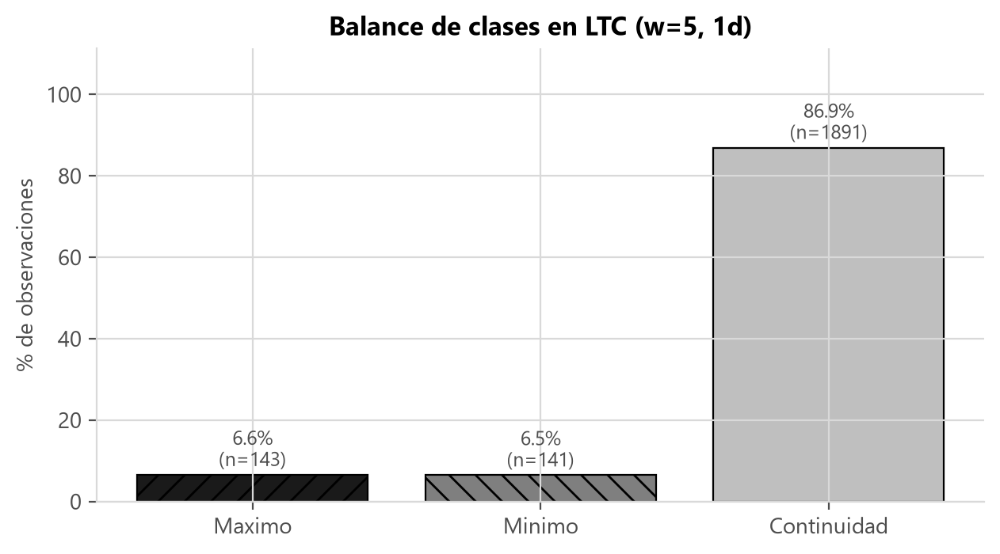
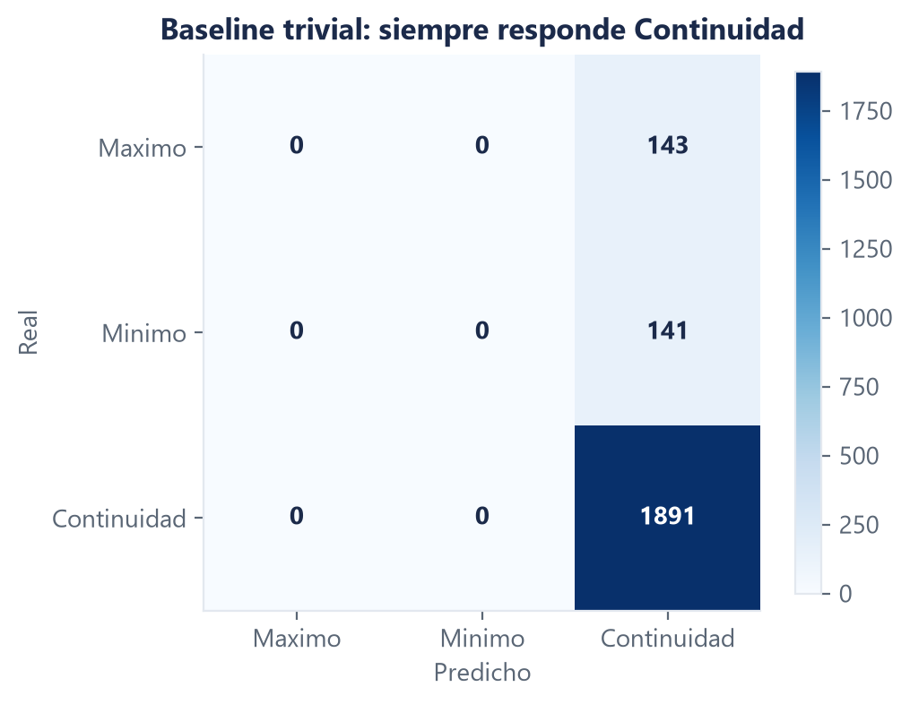

# Marco teórico: métricas de evaluación para puntos de inflexión

**Autor:** Alejandro Zamora · **Issue:** [S1-M2-06](https://github.com/NeoFao/caso1-ltc-inflexion/issues/33)

Es el noveno punto del bloque de criptoactivos del enunciado. Va en archivo aparte porque tiene
evidencia propia y da para una sección completa.

> **Nota para el ensamblaje (Fabrizio).** La numeración de figuras y tablas es local a esta
> sección (Figura 1 y 2, Tabla 1 a 3); hay que renumerar de corrido al unir los tres archivos.
> Las referencias están en APA 7 al final y **falta verificar volumen, páginas y DOI contra el
> original**.
>
> **Todos los números de esta sección se midieron con `w = 5`, `h = 3` y velas diarias**, que son
> los valores que hoy están marcados como `PROVISIONAL` en
> [`contracts/config.py`](../../../contracts/config.py). Si el equipo congela `w = 7` sobre 4
> horas, los números cambian y hay que regenerarlos; el argumento no cambia.

---

## 1. El problema que hay que explicar antes que nada

**Figura 1.** Distribución de las tres clases en LTC con `w = 5` sobre velas diarias
(n = 2 175 velas con etiqueta definida). Fuente: elaboración propia sobre datos de Binance.

| Clase | n | % |
|---|---|---|
| Máximo | 143 | 6,58 % |
| Mínimo | 141 | 6,48 % |
| Zona de Continuidad | 1 891 | 86,94 % |

**Tabla 1.** Balance de clases sobre la serie completa, `w = 5`, velas diarias. Fuente:
[`docs/evidencias/marco-teorico.json`](../../evidencias/marco-teorico.json).

Las clases están desbalanceadas **por construcción, no por accidente de los datos**. Como se
demostró en la sección 7 de [`m2-criptoactivos.md`](m2-criptoactivos.md), dos máximos no pueden
estar a menos de `w+1` velas de distancia —cada uno caería en la ventana del otro y cada uno
tendría que ser estrictamente mayor que el otro—, de modo que **como mucho 1 de cada `w+1` velas
puede ser Máximo**. Con `w = 5` esa cota aritmética es del 16,67 % por clase extrema, y la
medición sobre LTC da 6,58 %: bastante por debajo, como corresponde a un límite superior.

La distinción importa porque cambia qué se puede hacer al respecto. Un desbalance accidental
—una muestra mal recogida— se corrige recogiendo mejor. Este desbalance **no se puede corregir sin
cambiar la definición del problema**: bajar `w` produciría más ejemplos extremos, pero serían
giros más pequeños, es decir, otro problema. Elegir `w` es elegir simultáneamente la escala del
fenómeno y el grado de desbalance, y las dos cosas se deciden juntas o no se deciden.

La consecuencia práctica es que el desbalance no es un obstáculo que haya que quitar antes de
medir: es una propiedad permanente del problema, y las métricas tienen que elegirse sabiendo que
va a estar ahí en todas las evaluaciones (He & Garcia, 2009).

---

## 2. Por qué la exactitud no sirve: medido, no argumentado

**Figura 2.** Matriz de confusión del *baseline* trivial —el modelo que siempre responde "Zona de
Continuidad"— sobre LTC con `w = 5`, velas diarias. Fuente: elaboración propia.

**Medido sobre la serie completa de LTC, `w = 5`, velas diarias (n = 2 175):**

| Métrica | Baseline trivial |
|---|---|
| Exactitud | **0,869** |
| F1 macro | **0,310** |
| Precisión direccional | **0,000** |
| F1 de la clase Máximo | 0,000 |
| F1 de la clase Mínimo | 0,000 |
| F1 de la clase Continuidad | 0,930 |

**Tabla 2.** Rendimiento del baseline trivial. Fuente:
[`docs/evidencias/marco-teorico.json`](../../evidencias/marco-teorico.json).

Este es el resultado más importante de la sección y conviene decirlo sin rodeos.

Un modelo que **no detecta ni un solo punto de inflexión** —que es literalmente lo único que este
proyecto tiene que hacer— alcanza un **86,9 % de exactitud**. Si el informe reportara exactitud,
ese modelo parecería razonablemente bueno. Es la trampa completa del desbalance en un solo
número: la clase mayoritaria es tan dominante que ignorarla todo el resto sale barato.

Las otras dos métricas lo desenmascaran de inmediato:

- **F1 macro = 0,310.** Como promedia las tres clases con igual peso, los ceros de Máximo y
  Mínimo arrastran el promedio hacia abajo. El 0,310 es esencialmente 0,930 / 3.
- **Precisión direccional = 0,000.** De los 284 puntos de inflexión reales de la serie no acertó
  ninguno, porque no anunció ninguno.

Es exactamente el tipo de resultado que conviene poner nosotros en el informe antes de que lo
pregunten en la exposición.

### 2.1 Un contraste que lo deja más claro todavía

La exactitud no solo infla al modelo inútil: **puede ordenar los modelos al revés**. Para
mostrarlo se midieron los tres baselines obligatorios (RF-V2) sobre el **bloque de prueba** —el
último 15 % cronológico de la serie, con embargo de `w+h` velas en la frontera—, que es la
partición contra la que se evaluarán los modelos reales:

| Baseline | n | Exactitud | F1 macro | Precisión direccional | F1 Máximo | F1 Mínimo | F1 Continuidad |
|---|---|---|---|---|---|---|---|
| Trivial (siempre Continuidad) | 320 | **0,856** | 0,308 | 0,000 | 0,000 | 0,000 | 0,923 |
| Mayoritario | 320 | **0,856** | 0,308 | 0,000 | 0,000 | 0,000 | 0,923 |
| Aleatorio (semilla 0) | 320 | 0,716 | **0,320** | **0,065** | 0,000 | 0,125 | 0,835 |

**Tabla 3.** Los tres baselines sobre el bloque de prueba (11/09/2025 – 04/08/2026), `w = 5`,
`h = 3`, velas diarias. Fuente:
[`docs/evidencias/m2-baselines.json`](../../evidencias/m2-baselines.json).

Léase la tabla por columnas y el punto salta a la vista. **Por exactitud, el baseline trivial le
gana al aleatorio por 14 puntos porcentuales. Por F1 macro, el aleatorio le gana al trivial.** Las
dos métricas ordenan los mismos dos modelos en sentidos opuestos.

La razón es que el baseline aleatorio, por puro azar, anuncia algunos giros y acierta unos pocos
—precisión direccional de 0,065, es decir, 3 de los 46 extremos reales del bloque—, mientras que
el trivial nunca anuncia ninguno y acierta cero. En términos del problema que nos pusieron,
adivinar al azar es preferible a no intentarlo; la exactitud dice lo contrario. **Si la métrica de
decisión del proyecto fuera la exactitud, el proyecto premiaría al modelo que no hace nada.**

Dos observaciones más sobre la tabla, por honestidad:

- El baseline **mayoritario da exactamente lo mismo que el trivial**, y no es casualidad: con
  `w = 5` la clase más frecuente en entrenamiento es Continuidad, así que ambos aprenden a
  responder lo mismo. Se mantienen separados porque si alguna combinación de `(w, h)` cambiara la
  clase dominante, el mayoritario lo reflejaría y el trivial no.
- El baseline aleatorio tiene **F1 de Máximo igual a 0,000**: acertó algún mínimo por azar, pero
  ningún máximo. Con 24 máximos reales en 320 velas, ese resultado es esperable y recuerda que un
  número obtenido de una sola semilla tiene varianza.

---

## 3. Las métricas que sí usamos

Todas provienen de una única función compartida, `contracts/metrics.py::evaluar` (RF-V1). Que
haya una sola implementación no es burocracia: si dos personas calcularan el F1 con criterios
distintos, la comparación entre el modelo fundacional y el avanzado —que es la conclusión central
del proyecto— dejaría de ser una comparación.

### 3.1 F1-Score por clase

El F1 combina dos preguntas distintas sobre una misma clase:

- **Precisión:** de todos los giros que el modelo anunció, ¿cuántos eran de verdad giros? Mide
  cuánto cuesta creerle cuando habla.
- **Exhaustividad (*recall*):** de todos los giros que de verdad ocurrieron, ¿cuántos anunció?
  Mide cuánto se pierde.

El F1 es su **media armónica**: `F1 = 2·P·R / (P+R)`. Se usa la media armónica y no la aritmética
porque la armónica está dominada por el término más pequeño y por lo tanto **castiga el
desequilibrio entre las dos**. Un modelo con precisión 1,00 y exhaustividad 0,02 —anuncia un solo
giro en toda la serie y acierta— tiene media aritmética 0,51, que suena aceptable, y F1 de 0,039,
que es lo que corresponde. En un problema donde es trivial obtener precisión perfecta a costa de
no anunciar casi nada, esa propiedad es exactamente la que hace falta.

Reportarlo **por clase** y no solo agregado es indispensable aquí, porque las tres clases tienen
dificultades muy distintas: Continuidad es fácil por abundancia, y Máximo y Mínimo son el objetivo
real del trabajo. En la Tabla 2 se ve que el número agregado esconde dos ceros.

### 3.2 F1 macro, y por qué no ponderado

El **F1 macro** es el promedio simple de los tres F1 por clase. El **F1 ponderado** promedia
pesando cada clase por su frecuencia.

La elección es macro y es deliberada. Con la distribución de la Tabla 1, el ponderado le daría a
Continuidad un peso del 87 % del total, de modo que **premiaría acertar precisamente la clase que
un modelo inútil acierta bien**. El baseline trivial tendría un F1 ponderado de aproximadamente
0,81 —el 87 % de 0,930— frente a su F1 macro de 0,310. La misma predicción, dos números que
cuentan historias opuestas.

El macro tiene el efecto contrario y es el que corresponde: al dar igual peso a las tres clases,
un modelo solo puede obtener un buen valor si aprende algo sobre las clases raras. Es la
recomendación estándar cuando las clases minoritarias son las de interés (Sokolova & Lapalme,
2009; He & Garcia, 2009).

**Lo que hay que declarar como costo:** el macro tiene mayor varianza. Con 24 máximos en el bloque
de prueba, unos pocos aciertos o fallos mueven el F1 de esa clase de forma apreciable, y como el
macro pesa esa clase a un tercio, el ruido se propaga al número final. Por eso la comparación
entre modelos del proyecto exige un margen mínimo (`DELTA_F1_DECISIVO = 0,02`) fijado antes de
medir, en lugar de declarar ganador a cualquier diferencia positiva.

### 3.3 Precisión direccional

**Definición adoptada:** de todas las velas que de verdad fueron Máximo o Mínimo, qué fracción se
anunció con el tipo correcto. Las velas de Continuidad se ignoran, porque acertar "aquí no pasa
nada" no es acertar una dirección.

**Esta definición es nuestra y hay que decirlo.** El enunciado pide Precisión Direccional sin
precisar qué significa en un problema de clasificación de tres clases; el término proviene de la
literatura de pronóstico de series, donde se aplica a modelos de regresión y mide la fracción de
períodos en que se acierta el signo del cambio (Blaskowitz & Herwartz, 2011). Trasladarlo a un
problema multiclase admite más de una lectura, así que adoptamos una, la documentamos en un solo
lugar y la consultamos con el profesor. Declarar una ambigüedad del enunciado y explicar cómo se
resolvió suma en el criterio de análisis de la rúbrica; dejarla tapada, resta.

Dos propiedades de la implementación que conviene explicar:

- **Devuelve `NaN`, no 0,0, cuando en el período evaluado no hubo ningún extremo real.** No hubo
  nada que acertar; un cero se leería como fracaso del modelo cuando en realidad es ausencia de
  evidencia.
- **Es ciega a los falsos positivos.** Un modelo que anunciara "Máximo" en todas las velas
  obtendría una precisión direccional cercana a 0,50 —acertaría todos los máximos reales y ningún
  mínimo; sobre el bloque de prueba serían 24 de 46, esto es 0,52— pese a ser inservible. Por eso la precisión direccional **nunca se reporta sola**: acompaña al
  F1 macro, que sí penaliza los falsos positivos. Es una métrica que responde "cuando hay un giro,
  ¿le acertamos al tipo?", y esa pregunta solo tiene sentido junto a "¿cuántas veces lo anuncia
  cuando no lo hay?".

### 3.4 Matriz de confusión

Es la única de las cuatro que muestra **qué tipo** de error comete el modelo, y en este problema
los tipos de error no son equivalentes:

- **Confundir un extremo con Continuidad** es un error de *detección*: el sistema se quedó
  callado cuando había algo que anunciar. Cuesta una oportunidad.
- **Confundir un Máximo con un Mínimo** es un error de *dirección*: el sistema anunció lo
  contrario de lo que pasaba. En una aplicación real, esa es la diferencia entre no operar y
  operar en el sentido equivocado.

Ningún número agregado distingue esos dos casos; la matriz sí. En la Figura 2 se ve que el
baseline trivial concentra todos sus errores en la columna de Continuidad: 24 máximos y 22
mínimos clasificados como "no pasa nada". No comete ni un solo error de dirección, porque nunca
anuncia dirección alguna.

### 3.5 Exactitud

Se reporta, pero **solo para mostrar por qué no sirve**. Las Tablas 2 y 3 son el argumento
completo, y tenerlo medido en el informe es más convincente que argumentarlo.

---

## 4. Una advertencia sobre cómo leer la matriz de confusión de este problema

La medición de sensibilidad al ruido de la sección 8.4 de
[`m2-criptoactivos.md`](m2-criptoactivos.md) arrojó un resultado que condiciona la lectura de
todas las métricas anteriores: **el modo de fallo dominante del etiquetado bajo ruido no es
perder giros, es correrlos una vela de lugar**. Con un ruido equivalente al 72 % del movimiento
típico por vela, el detector encuentra el 96,0 % de los giros verdaderos pero solo el 72,9 % cae
en la vela exacta.

Las cuatro métricas de esta sección evalúan vela a vela, sin ninguna tolerancia temporal. Eso
significa que un modelo que anuncie un máximo una vela antes o después del real será penalizado
igual que uno que no lo anuncie nunca: la matriz de confusión lo registrará como un falso positivo
en Máximo más un falso negativo en Máximo. **Conviene tenerlo presente al interpretar los
resultados y decirlo explícitamente en el informe**, porque la diferencia entre "el modelo no
detecta los giros" y "el modelo los detecta con un desfase de una vela" es enorme en términos
prácticos y nula en términos de F1.

No proponemos cambiar las métricas: el enunciado pide estas y la comparación entre modelos tiene
que hacerse sobre una definición fija. Lo que proponemos es **reportar además, como análisis
complementario, la distribución del desfase temporal de las detecciones**, que es información que
las cuatro métricas oficiales no pueden expresar.

---

## 5. El baseline como piso obligatorio

El criterio de decisión del proyecto, fijado antes de ver ningún resultado:

> **Todo modelo se compara contra los tres baselines, y si no supera al mejor de ellos en F1 macro
> por al menos `DELTA_F1_DECISIVO = 0,02`, no aporta nada** —por mucho que su exactitud impresione
> en una lámina.

Los tres baselines existen porque cada uno descarta una explicación alternativa distinta del
resultado de un modelo:

- **Trivial** (siempre Continuidad): descarta que el modelo esté simplemente explotando el
  desbalance.
- **Mayoritario** (la clase más frecuente del entrenamiento): descarta lo mismo sin asumir de
  antemano cuál es la clase dominante, de modo que sigue siendo válido si se cambia `(w, h)`.
- **Aleatorio** (respetando las frecuencias de clase): descarta que los aciertos del modelo sobre
  las clases raras se expliquen por la frecuencia con que las anuncia. Es el más exigente de los
  tres en F1 macro, como muestra la Tabla 3, y por eso es el que hay que superar.

Que el aleatorio resulte ser el piso más alto en F1 macro (0,320 contra 0,308 del trivial) es en
sí mismo un resultado útil: **fija la vara en el número correcto**. Un modelo que reportara un F1
macro de 0,31 habría superado al baseline trivial y no habría demostrado nada.

---

## Referencias

> **Pendiente de verificación.** Redactadas en APA 7 a partir de fuentes conocidas del área;
> **hay que comprobar volumen, páginas y DOI contra el original antes de la entrega definitiva.**

Blaskowitz, O., & Herwartz, H. (2011). On economic evaluation of directional forecasts.
*International Journal of Forecasting, 27*(4), 1058–1065.
https://doi.org/10.1016/j.ijforecast.2010.07.002

Chicco, D., & Jurman, G. (2020). The advantages of the Matthews correlation coefficient (MCC)
over F1 score and accuracy in binary classification evaluation. *BMC Genomics, 21*, 6.
https://doi.org/10.1186/s12864-019-6413-7

He, H., & Garcia, E. A. (2009). Learning from imbalanced data. *IEEE Transactions on Knowledge
and Data Engineering, 21*(9), 1263–1284. https://doi.org/10.1109/TKDE.2008.239

López de Prado, M. (2018). *Advances in financial machine learning*. John Wiley & Sons.

Saito, T., & Rehmsmeier, M. (2015). The precision-recall plot is more informative than the ROC
plot when evaluating binary classifiers on imbalanced datasets. *PLOS ONE, 10*(3), e0118432.
https://doi.org/10.1371/journal.pone.0118432

Sokolova, M., & Lapalme, G. (2009). A systematic analysis of performance measures for
classification tasks. *Information Processing & Management, 45*(4), 427–437.
https://doi.org/10.1016/j.ipm.2009.03.002

---

> **Nota sobre los números.** Los de las Tablas 1 y 2 salen de
> [`docs/evidencias/marco-teorico.json`](../../evidencias/marco-teorico.json) y están medidos
> sobre la serie completa. Los de la Tabla 3 salen de
> [`docs/evidencias/m2-baselines.json`](../../evidencias/m2-baselines.json) y están medidos sobre
> el bloque de prueba, que es la partición correcta para comparar modelos. Todos con `w = 5`,
> `h = 3` y velas diarias, que es el valor **provisional** del contrato. Si el equipo congela
> `w = 7` sobre 4 horas, los tres conjuntos de números cambian; el argumento no.
