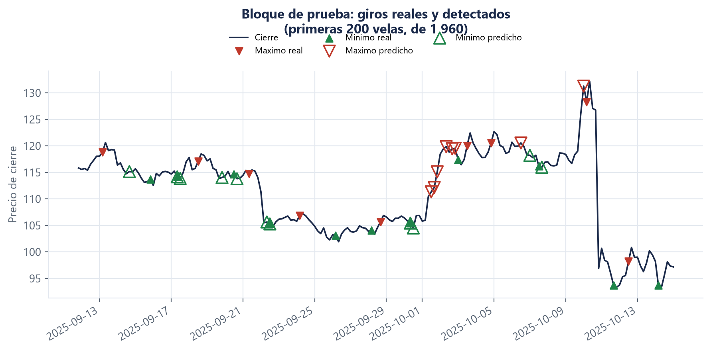
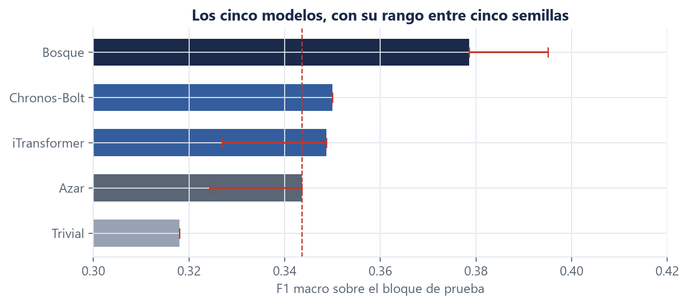

# 5. Rendimiento

**Autor:** Fabrizio Espinoza (M0), sobre la mitad de modelos profundos de Isaac Fallas (M3) ·
**Fuente del material:** `docs/evidencias/m3-modelos-profundos-4h-w7-h1.json`,
`docs/evidencias/modelo-clasico-4h-w7-h1-rezagos-relativos.json`, D5, D16, D18, D25 · **Todas las
cifras salen de `docs/evidencias/`.**

Esta sección tiene dos partes que **no** significan lo mismo:

- **5.1 a 5.3 · Validación.** Sobre estos datos se compararon modelos y se tomaron decisiones. Se
  pudieron mirar tantas veces como hizo falta, y por eso mismo **no son una estimación honesta del
  rendimiento futuro**: elegir mirando estos números los infla.
- **5.4 · El bloque de prueba.** Se mide **una sola vez** y es la única cifra del informe que estima
  qué haría el sistema con datos que nadie usó para decidir nada.

---

## 5.1 La comparación sobre validación

**Tabla 1.** Los nueve modelos evaluados sobre las 1 959 velas de validación, ordenados por F1
macro. Todos entrenados solo con el bloque de entrenamiento y medidos por el mismo arnés.

| Modelo | Papel | F1 macro | Precisión direccional |
|---|---|---|---|
| **Bosque aleatorio** (rezagos relativos) | referencia clásica | **0,390498** | **0,103627** |
| Chronos-Bolt | fundacional (D12) | 0,368589 | 0,093264 |
| Bosque sin rezagos | variante | 0,367201 | 0,088083 |
| iTransformer | avanzado | 0,345706 | 0,077720 |
| Baseline aleatorio | **piso obligatorio (D7)** | 0,336784 | 0,051813 |
| iTransformer solo LTC | variante | 0,324474 | 0,051813 |
| Baseline trivial | piso | 0,316063 | 0,000000 |
| Baseline mayoritario | piso | 0,316063 | 0,000000 |
| Bosque sin pesos de clase | variante | 0,316063 | 0,000000 |

Tres lecturas inmediatas:

**El mejor modelo es el clásico.** Ni el fundacional ni el avanzado le ganan. Lo dice la tabla y lo
confirman los intervalos de 5.2.

**Los tres modelos que dan 0,316063 exactos están empatados con no hacer nada.** El baseline trivial,
el mayoritario y el bosque sin pesos de clase producen el mismo número porque hacen lo mismo:
responder siempre «continuidad». El bosque **sin reponderar las clases colapsa a la mayoritaria** —
es la evidencia directa de por qué el `class_weight` no es un detalle de configuración.

**La precisión direccional del mejor modelo es 0,103627.** Mejor que el azar (0,051813) y que el
trivial (0,0). Y baja. La sección 6 dice qué se puede y qué no se puede concluir de eso.

---

## 5.2 Comparar medias no alcanza: los intervalos

Una diferencia de F1 macro entre dos modelos puede venir de que uno sea mejor o de qué velas cayeron
en el bloque. Para separarlo se usa **remuestreo pareado**: se remuestrean las **mismas filas** para
los dos modelos a la vez, muchas veces, y se mira el intervalo de la **diferencia**.

Va pareado porque si los dos modelos aciertan y fallan sobre las mismas velas sus errores están
correlacionados, y el intervalo de la diferencia es más estrecho que lo que sugeriría el solape de
los intervalos individuales.

**Tabla 2.** Diferencias contra el `baseline_aleatorio` y contra el bosque, con intervalo al 95 %.

| Comparación | Diferencia | Intervalo 95 % | ¿Excluye el cero? |
|---|---|---|---|
| Chronos-Bolt − azar | +0,031805 | [−0,002956 , +0,065236] | **no** |
| iTransformer − azar | +0,008922 | [−0,024084 , +0,044635] | **no** |
| Chronos-Bolt − bosque | −0,021908 | [−0,064249 , +0,020264] | **no** |
| iTransformer − bosque | −0,044792 | [−0,085204 , −0,001457] | sí, **pero ver 5.3** |

**Lo que dice esta tabla, en orden de incomodidad:**

1. **Ninguno de los dos modelos profundos supera al azar de forma distinguible.** Le ganan en la
   media, y el intervalo incluye el cero en los dos casos. Es el resultado central del informe y va
   sin adornos.
2. **Entre el fundacional y el avanzado no se distingue nada.** Por la D5, cuando el margen y el
   intervalo discrepan manda el intervalo, y se prefiere el más simple: el fundacional, que ni se
   entrena.
3. **El bosque clásico es el único que supera al azar de forma distinguible**, y es el modelo que el
   enunciado no pedía.

---

## 5.3 Un intervalo de esta tabla no se reproduce, y se declara

La última fila de la tabla 2 excluye el cero. **Ese resultado no se reproduce.**

El ensayo en seco del 07/09 volvió a medir validación —mismo código, mismos datos, mismas cinco
semillas— y el intervalo cambió de lado:

| Corrida | Diferencia | Intervalo 95 % | ¿Excluye el cero? |
|---|---|---|---|
| Comprometida (21/08) | −0,044792 | [−0,085204 , **−0,001457**] | **sí** |
| Ensayo en seco (07/09) | −0,042894 | [−0,081945 , **+0,001996**] | **no** |

El límite superior vive a menos de 0,002 del cero: el veredicto binario se da vuelta aunque la cifra
casi no se mueva.

**La causa está identificada, y no es el remuestreo.** El generador del remuestreo está sembrado, así
que el intervalo es determinista **dadas las predicciones**. Lo que se mueve es el iTransformer, que
no reproduce entre procesos (D15).

**Y el fondo no es fragilidad, es el instrumento equivocado.** El remuestreo pareado resamplea las
**filas** condicionando en **un solo sorteo del entrenamiento**. Cuando el sorteo del entrenamiento
es la fuente dominante de variación, el supuesto del intervalo —predicciones fijas— no se cumple.

Por eso la **D25** decide, **antes** de tocar el bloque de prueba: donde entre un modelo que no
reproduce, el intervalo **se reporta pero no decide**, y el peso lo lleva la estabilidad del signo
entre semillas.

**Lo que sí sostiene esa fila, entonces:** el iTransformer queda por debajo del bosque **en las cinco
semillas**, 0,345357 de media contra 0,380975. El signo es estable; la distinguibilidad por intervalo
no se afirma.

> **El alcance está acotado y medido.** El bosque y el `baseline_aleatorio` reproducen **bit a bit
> entre procesos** — misma huella SHA-256 de las 1 959 predicciones en tres procesos distintos, en
> `m0-reproducibilidad-predicciones-4h-w7-h1.json`. La comparación de la que depende el veredicto del
> proyecto —el mejor modelo contra el azar— **no está afectada**.

---

## 5.4 El bloque de prueba

**Medido el 07/09/2026, una sola vez**, sobre el commit `1426bce` con el árbol limpio. El pestillo
lo registra con `n_corridas: 1`, seis modelos, cinco semillas, en una sola sesión.

La **Figura 1** muestra qué hace el sistema sobre esos datos: los giros reales van como marcadores
rellenos y los que el modelo predijo como marcadores huecos encima. Se ve dónde acierta —los
extremos grandes del 10 de octubre— y dónde predice de más, en racimos alrededor de un solo giro
real.



**Figura 1.** Bloque de prueba: giros reales y detectados por el modelo, en las primeras 200 velas.
Fuente: `docs/evidencias/informe-f1-prueba-giros.png`.

**Tabla 5.** Las 1 960 velas del bloque de prueba, semilla de referencia.

| Modelo | F1 macro | Precisión direccional | F1 máximo | F1 mínimo |
|---|---|---|---|---|
| **Bosque aleatorio** | **0,378567** | **0,104651** | 0,046154 | 0,165746 |
| Chronos-Bolt | 0,349991 | 0,063953 | 0,062992 | 0,070707 |
| iTransformer | 0,348751 | 0,093023 | 0,116071 | 0,032432 |
| Baseline aleatorio | 0,343546 | 0,063953 | 0,077778 | 0,044944 |
| Baseline mayoritario | 0,318036 | 0,000000 | 0,000000 | 0,000000 |
| Baseline trivial | 0,318036 | 0,000000 | 0,000000 | 0,000000 |

El orden es **el mismo que en validación**: gana el bosque, y ningún modelo profundo lo supera.

La **Figura 2** pone esa tabla en perspectiva: las barras invitan a leer un orden, y el rango entre
las cinco semillas —dibujado encima— muestra cuánto de ese orden aguanta. La línea roja es el azar.



**Figura 2.** Los cinco modelos sobre el bloque de prueba, con su rango entre cinco semillas y el
piso del azar. Fuente: `docs/evidencias/informe-f3-modelos-prueba.png`.

### La regla de decisión, aplicada

La sección 5 del protocolo declara que el proyecto **detecta puntos de inflexión** si el mejor
modelo cumple **las tres** condiciones de la D16 contra el `baseline_aleatorio`.

**Tabla 6.** Las tres condiciones sobre el bloque de prueba.

| Condición | Resultado | ¿Se cumple? |
|---|---|---|
| 1 · La diferencia es positiva | **+0,051367** de media en cinco semillas | **Sí** |
| 2 · El intervalo del 95 % excluye el cero | [**−0,004861** , +0,074113] | **No** |
| 3 · El signo no cambia en cinco semillas | positiva en las **cinco** | **Sí** |

**Dos de tres. El protocolo exige las tres.**

### Lo que el informe dice, escrito antes de saber cuál tocaba

Es el segundo de los tres casos previstos, y se reporta con las palabras que ya estaban escritas:

> **No podemos afirmar que el sistema detecte puntos de inflexión mejor que el azar sobre el
> bloque de prueba.** La diferencia es positiva y estable en signo, y su intervalo incluye el
> cero.

Y la segunda mitad de esa lectura, que el protocolo también dejó escrita: **la caída respecto de
validación es la que cabe esperar cuando se elige mirando uno de los dos conjuntos.** El bosque
pasa de 0,390498 en validación a 0,378567 en prueba — una caída pequeña; lo que se
estrecha es la **ventaja sobre el azar**, porque el baseline aleatorio sube de 0,336784 a 0,343546.

> **Y hay algo que se midió después, y que cambia cómo se lee esta tabla.** La condición 2 falló
> con **1 960 filas**. Repitiendo la medición sobre **7 311** —las predicciones de nueve tramos
> consecutivos, juntas— la ventaja del mismo modelo sobre el azar es **+0,051285** con intervalo
> **[+0,033296 , +0,070146]**, que **sí excluye el cero**.
>
> El efecto es prácticamente el mismo que aquí (+0,035021). **Lo que faltaba era muestra, no
> efecto.** Está en las conclusiones, con lo que no demuestra escrito al lado.
>
> **Esto no cambia lo que esta sección reporta.** La cifra de arriba sigue siendo la única
> estimación limpia, y el veredicto del protocolo se aplicó como estaba escrito. Lo que añade es la
> explicación de *por qué* falló, que es distinta de una excusa: está medida.

### El criterio de aceptación falla, y por una razón que no es la del intervalo

Hay un segundo veredicto en la evidencia, y es más severo:

```
supera_al_trivial        True    (+0,060531)
detecta_ambos_extremos   FALSE
  F1 Máximo  0,046154  contra 0,077778 del azar   <- PEOR que el azar
  F1 Mínimo  0,165746  contra 0,044944 del azar
```

Sobre datos no vistos, **el mejor modelo detecta los mínimos casi cuatro veces mejor que el azar y
los máximos peor que el azar.** El F1 macro sube porque el mínimo compensa; la detección de una de
las dos clases que importan, no ocurre.

El propio guion lo imprimió sin que nadie se lo pidiera:

> El criterio de aceptación se cumple por un margen que no es detección. Esto va al informe tal
> cual: «corre» y «funciona» no son lo mismo.

> **Y esto también se midió después.** El F1 de una clase con 86 ejemplos es la cifra más ruidosa
> del informe. Repetida sobre 7 311 filas, la comparación se da vuelta: el bosque supera al azar en
> **Máximo** por +0,043611, con intervalo que excluye el cero, y en **Mínimo** por +0,048673.
>
> **Lo de arriba pasó y queda reportado.** Lo que se añade es qué significa: no que el modelo no
> detecte máximos, sino que 86 ejemplos no alcanzan para verlo. Está en las conclusiones.

**Esta es la conclusión honesta del proyecto**, y no se busca una configuración que la mejore: la
sección 7 del protocolo lo prohíbe explícitamente, y el resultado negativo bien medido es la
contribución.

### Un hueco de la herramienta, declarado

La condición 2 **no la calculó la corrida**: `comparar_fundacional` solo produce intervalos
pareados de los modelos profundos, y el mejor modelo resultó ser el bosque. Se completó después,
verificando que las predicciones recalculadas reprodujeran **exactamente** el F1 que la corrida
había escrito — los dos modelos reproducen bit a bit entre procesos, así que no es una segunda
medición sino la lectura de la primera. Está en la **D28**, y el pestillo sigue diciendo
`n_corridas: 1`.

**La expectativa se dijo de antemano, y se cumplió:** no había razón para esperar que el bloque de
prueba mejorara lo de validación. Esperar que datos no vistos favorezcan a un modelo más que los
datos con los que se eligió es al revés de como funciona.
